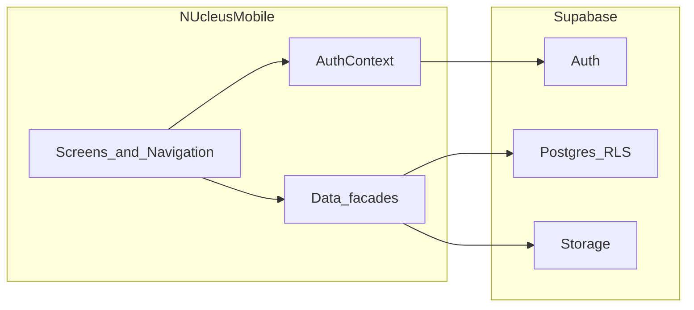

# NUcleus Mobile — Project Context

This document is the **canonical reference** for the NUcleus React Native (Expo) mobile application. Use it to onboard engineers and AI-assisted development sessions. For migration execution steps from the legacy Express API layer to direct Supabase, see [IMPLEMENTATION_PLAN.md](./IMPLEMENTATION_PLAN.md).

**Product identity:** NUcleus Mobile — React Native + Expo, targeting **direct Supabase** integration (Auth, Postgres, Storage). **Audience:** enrolled students at **National University - Dasmarinas** only.

---

## Purpose and scope

NUcleus is a student research repository and academic workflow platform. The mobile app gives students a focused client to **authenticate**, **discover and read** published research, **track their own submissions’ progress** (read-only workflow visibility), **manage notifications**, and **respond to co-author invitations**.

The mobile app is **not** a submission or editorial tool. It emphasizes repository browsing, detail views, PDF access, personal analytics, and lightweight workflow visibility aligned with the shared backend.

---

## Relationship to other codebases

Three related projects define different aspects of parity:

1. **Web application** (`capstone-nucleus`, sibling repo on your machine) — **Source of truth** for domain language, **database schema**, **Row Level Security** expectations, workflow status names, field semantics, permissions, notification semantics, and invitation behavior. Any Supabase query or policy on mobile must remain compatible with how the web platform models data.

2. **Legacy Flutter mobile app** (`capstone-nucleus-mobile`) — **Technical reference** for **direct Supabase** usage on mobile: initializing the client, `signInWithPassword`, querying tables such as `users` and `research_papers`, storage bucket access (e.g. `research-papers`), and patterns for published vs. personal papers. The React Native refactor should converge toward this style of integration. Note: the Flutter codebase may contain legacy login branches (for example bcrypt or debug-only paths); the RN app should standardize on **Supabase Auth** with session listeners unless product explicitly requires legacy compatibility—confirm against production schema and auth setup.

3. **This React Native app** (`capstone-nucleus-rn`) — Intended **primary mobile client**, replacing the Flutter app over time. It must stay student-only and preserve navigation and student workflows while the **data layer** moves from Express APIs to Supabase.

---

## Included features (student scope)

The following are **in scope** for NUcleus Mobile:

- Student **authentication** and **session persistence**
- **Browse** published research (repository)
- **Research detail** (metadata, workflow history where exposed, view/download counts)
- **Open/view PDF** via resolved file URLs (in-app browser or equivalent)
- **My Papers** — list and filter the signed-in student’s papers
- **Dashboard / analytics** — aggregates derived from “my papers” (status buckets, recents)
- **Notifications** — list, unread behavior, mark one read, mark all read
- **Co-author invitations** — list, accept, decline

---

## Excluded features (locked)

Do **not** implement or reintroduce:

- Research **submission** workflow (no submit flow on mobile)
- **Draft** create/update/delete
- **Faculty**, **dean**, **program chair**, **staff**, **editor**, or **admin** dashboards or workflow actions
- Any **non-student** primary experience

Submission-adjacent API helpers (for example submission policy or register endpoints) may exist in code history; they are **not** part of the mobile product scope.

---

## Role rules

- The only role that may use the **student shell** (tabs and research detail) is **`student`**.
- Shared TypeScript types may include `faculty`, `dean`, `program_chair`, `staff`, `admin` because they reflect the **shared backend contract**.
- After authentication, if the profile role is **not** `student`, the user must see the **Unsupported Role** screen and must **not** access student tabs.

Implementation reference: `src/navigation/AppNavigator.tsx` gates on `user.role !== 'student'`.

---

## Architecture

### Target architecture (direction of travel)

```
React Native app  →  Supabase Auth
                   →  Supabase Postgres (RLS)
                   →  Supabase Storage (PDFs)
```

The app should use `@supabase/supabase-js` with session persistence appropriate for Expo (AsyncStorage adapter per Supabase guidance). Screens and contexts call thin **data facades** (existing `researchApi`-style modules can remain as **interfaces** implemented with Supabase instead of HTTP).

### Historical architecture (being phased out)

Previously (and as described in legacy handoff notes):

```
React Native app  →  Express API  →  Supabase
```

That path implied custom **`/auth/login`**, **`/auth/refresh`**, **`/auth/me`**, and research/notification routes. Phase 2 of the migration removes **dependence on Express availability** for the mobile client; auth now uses Supabase directly.



---

## Navigation and technical structure

### Route model

Defined in `src/navigation/types.ts`:

- **Root stack:** `Login` → (if authenticated and not student) `UnsupportedRole` → (if student) `StudentTabs` + stack screen `ResearchDetail` with `{ paperId: string }`.
- **Student tabs:** `Dashboard`, `MyPapers`, `Browse`, `Notifications`, `Invitations`.

**Principle:** Preserve this structure through the Supabase migration unless a technical requirement forces a minimal adjustment (for example auth listener placement).

### Key source locations

| Area | Location |
|------|----------|
| App entry | `App.tsx`, `index.ts` |
| Environment | `src/config/env.ts` (today: API URL; future: Supabase URL + anon key) |
| Auth state | `src/context/AuthContext.tsx` |
| Token storage (legacy) | `src/storage/authStorage.ts` |
| Navigation | `src/navigation/AppNavigator.tsx`, `src/navigation/types.ts` |
| Domain types | `src/types/domain.ts` |
| API facades (to become Supabase-backed) | `src/api/auth.ts`, `research.ts`, `notifications.ts`, `invitations.ts`, `http.ts` |

---

## Workflows (student)

Typical journeys:

1. **Login** → session restore → **student** profile loads → **StudentTabs**.
2. **Browse** → filter/search published papers → **ResearchDetail** → optional PDF open.
3. **My Papers** / **Dashboard** → same paper list semantics; dashboard computes summary stats from loaded papers.
4. **Notifications** → fetch list → mark read / mark all read.
5. **Invitations** → list pending → accept or decline by token.

Deep navigation to research uses stack params `ResearchDetail` / `paperId`.

---

## Workflow vocabulary (shared with web)

Mobile UI may not show every status, but types and data must stay compatible with the web platform. Examples include:

- `pending_faculty`, `pending_dean`, `pending_program_chair`, `pending_editor`, `pending_admin`
- `approved`, `rejected`, `revision_required`

Additional values may appear in API responses; `PaperStatus` in `src/types/domain.ts` allows a string fallback for forward compatibility.

---

## Data model expectations

The app types in `src/types/domain.ts` mirror the **contract** the Express layer normalized; after migration, map Supabase rows to these shapes **without renaming** backend fields unnecessarily. Research-related fields include (non-exhaustive):

- Identity and ownership: `author_id` (as modeled in API/web), structured authors / co-authors
- Content: `title`, `abstract`, `keywords`, `category`
- Files: `file_url`, `file_name`, `file_size`
- Workflow: `status`, `faculty_id`, `department`, `department_id`, `revision_notes`, `rejection_reason`
- Engagement: `view_count`, `download_count`, `allow_download`, `allow_highlight`

Notifications and co-author invitation structs should align with tables and RPCs documented in the web project and enforced by RLS.

---

## Technical stack

- **Expo** (SDK aligned with `package.json`)
- **TypeScript**
- **React Navigation** (native stack + bottom tabs)
- **React Context** for auth
- **AsyncStorage** (persistence; used with Supabase session storage for RN)
- **Target:** `@supabase/supabase-js`

**To remove or significantly reduce after migration:** Axios-centric `src/api/http.ts`, refresh-token interceptor, sole reliance on `EXPO_PUBLIC_API_URL`.

---

## Environment configuration

**Current (Express era):** `EXPO_PUBLIC_API_URL` — base URL including `/api`.

**Target (direct Supabase):**

- `EXPO_PUBLIC_SUPABASE_URL`
- `EXPO_PUBLIC_SUPABASE_ANON_KEY`

Secrets must not be committed. Copy from `.env.example` once updated as part of the migration (see implementation plan).

Physical devices do not need a LAN IP for a local Express server once Supabase is used in the cloud; emulator/simulator network notes from the handoff apply mainly to the legacy API setup.

---

## How to run (development)

1. `npm install`
2. Configure `.env` from `.env.example` (variables depend on migration phase—see [IMPLEMENTATION_PLAN.md](./IMPLEMENTATION_PLAN.md))
3. `npm run start` — Expo dev server; open Android emulator, iOS simulator, or Expo Go on device

Validation expectations: TypeScript clean (`npx tsc --noEmit` if configured), manual smoke of auth, student gate, browse, detail + file, notifications, invitations after substantive changes.

---

## Related documentation

| Document | Role |
|----------|------|
| **This file** | Canonical product + architecture context for RN |
| [IMPLEMENTATION_PLAN.md](./IMPLEMENTATION_PLAN.md) | Phased Express → Supabase migration |
| [TRANSITION_HANDOFF.md](./TRANSITION_HANDOFF.md) | Historical snapshot: Express endpoints, file map, and setup notes. Still useful while migrating **endpoint-by-endpoint**; **backend strategy** in that file is obsolete—direct Supabase is the goal. |
| Web repo `capstone-nucleus` | Schema, RLS, workflow semantics |
| Flutter repo `capstone-nucleus-mobile` | Direct Supabase query and storage patterns |

---

## Principles for future work

- **Incremental** migration; avoid full rewrite.
- **Preserve** navigation and student UX unless blocked by Supabase integration.
- **Student-only** and **no submission workflow** are non-negotiable.
- **Web** defines schema and vocabulary; **Flutter** informs mobile Supabase patterns; **this repo** implements the RN client.
