# ERD Full System - NUcleus

```mermaid
erDiagram
    USERS {
        uuid id PK
        varchar email UK
        varchar role
        uuid department_id FK
        uuid program_id FK
        varchar first_name
        varchar last_name
        bool is_active
        varchar recovery_email
    }

    DEPARTMENTS {
        uuid id PK
        varchar name UK
        varchar code UK
        bool is_active
    }

    PROGRAMS {
        uuid id PK
        uuid department_id FK
        varchar name
        varchar code
        bool is_active
    }

    RESEARCH_PAPERS {
        uuid id PK
        varchar title
        varchar status
        uuid author_id FK
        uuid faculty_id FK
        uuid dean_chair_id FK
        uuid department_id FK
        uuid program_id FK
        uuid bypassed_by FK
        uuid deleted_by FK
        timestamptz deleted_at
        text category
    }

    RESEARCH_AUTHORS {
        uuid id PK
        uuid research_id FK
        uuid user_id FK
        int4 author_order
        bool is_primary
    }

    APPROVAL_WORKFLOW {
        uuid id PK
        uuid research_id FK
        uuid reviewer_id FK
        varchar reviewer_role
        varchar status
        varchar action_type
        timestamptz reviewed_at
    }

    FACULTY_CONFLICT_DECLARATIONS {
        uuid id PK
        uuid faculty_id FK
        uuid research_id FK
        text reason
        timestamptz declared_at
    }

    RESEARCH_COMMENTS {
        uuid id PK
        uuid research_id FK
        uuid user_id FK
        uuid parent_id FK
        bool is_internal
        text comment
    }

    CO_AUTHOR_INVITATIONS {
        uuid id PK
        uuid research_id FK
        uuid inviter_id FK
        uuid invitee_id FK
        text token UK
        text status
        timestamptz expires_at
    }

    NOTIFICATIONS {
        uuid id PK
        uuid user_id FK
        uuid research_id FK
        varchar type
        bool is_read
    }

    PAPER_VIEWS {
        uuid id PK
        uuid paper_id FK
        uuid user_id FK
        timestamptz viewed_at
    }

    PAPER_DOWNLOADS {
        uuid id PK
        uuid paper_id FK
        uuid user_id FK
        timestamptz downloaded_at
    }

    SUBMISSION_DRAFTS {
        uuid id PK
        uuid user_id FK
        uuid paper_id FK
        jsonb draft_data
        timestamptz updated_at
    }

    PASSWORD_RESET_TOKENS {
        uuid id PK
        uuid user_id FK
        varchar token_hash UK
        timestamptz expires_at
        timestamptz used_at
    }

    AUDIT_LOGS {
        uuid id PK
        uuid user_id FK
        varchar user_role
        varchar action
        varchar target_type
        uuid target_id
        timestamptz created_at
    }

    RESEARCH_CATEGORIES {
        uuid id PK
        varchar name UK
        text description
    }

    WORKFLOW_STAGES {
        uuid id PK
        text code UK
        text label
        text reviewer_role
        int4 position
        bool is_active
    }

    SYSTEM_POLICY_SETTINGS {
        bool id PK
        int4 max_file_size_mb
        text[] allowed_file_types
        uuid updated_by
        jsonb legacy_policy_overrides
    }

    PROFILES {
        uuid id PK
        text role
    }

    DEPARTMENTS ||--o{ USERS : "users_department_id_fkey"
    PROGRAMS ||--o{ USERS : "users_program_id_fkey"
    DEPARTMENTS ||--|{ PROGRAMS : "programs_department_id_fkey"

    USERS ||--|{ RESEARCH_PAPERS : "research_papers_author_id_fkey"
    USERS ||--o{ RESEARCH_PAPERS : "research_papers_faculty_id_fkey"
    USERS ||--o{ RESEARCH_PAPERS : "research_papers_dean_chair_id_fkey"
    USERS ||--o{ RESEARCH_PAPERS : "research_papers_bypassed_by_fkey"
    USERS ||--o{ RESEARCH_PAPERS : "research_papers_deleted_by_fkey"
    DEPARTMENTS ||--o{ RESEARCH_PAPERS : "research_papers_department_id_fkey"
    PROGRAMS ||--o{ RESEARCH_PAPERS : "research_papers_program_id_fkey"

    RESEARCH_PAPERS ||--|{ APPROVAL_WORKFLOW : "approval_workflow_research_id_fkey"
    USERS ||--|{ APPROVAL_WORKFLOW : "approval_workflow_reviewer_id_fkey"

    RESEARCH_PAPERS ||--|{ RESEARCH_AUTHORS : "research_authors_research_id_fkey"
    USERS ||--|{ RESEARCH_AUTHORS : "research_authors_user_id_fkey"

    RESEARCH_PAPERS ||--|{ RESEARCH_COMMENTS : "research_comments_research_id_fkey"
    USERS ||--|{ RESEARCH_COMMENTS : "research_comments_user_id_fkey"
    RESEARCH_COMMENTS ||--o{ RESEARCH_COMMENTS : "research_comments_parent_id_fkey"

    RESEARCH_PAPERS ||--|{ CO_AUTHOR_INVITATIONS : "co_author_invitations_research_id_fkey"
    USERS ||--|{ CO_AUTHOR_INVITATIONS : "co_author_invitations_inviter_id_fkey"
    USERS ||--|{ CO_AUTHOR_INVITATIONS : "co_author_invitations_invitee_id_fkey"

    RESEARCH_PAPERS ||--o{ NOTIFICATIONS : "notifications_research_id_fkey"
    USERS ||--|{ NOTIFICATIONS : "notifications_user_id_fkey"

    RESEARCH_PAPERS ||--o{ PAPER_VIEWS : "paper_views_paper_id_fkey"
    USERS ||--o{ PAPER_VIEWS : "paper_views_user_id_fkey"
    RESEARCH_PAPERS ||--o{ PAPER_DOWNLOADS : "paper_downloads_paper_id_fkey"
    USERS ||--o{ PAPER_DOWNLOADS : "paper_downloads_user_id_fkey"

    USERS ||--|{ PASSWORD_RESET_TOKENS : "password_reset_tokens_user_id_fkey"
    USERS ||--o{ AUDIT_LOGS : "audit_logs_user_id_fkey"

    USERS ||--|{ FACULTY_CONFLICT_DECLARATIONS : "faculty_conflict_faculty_fkey"
    RESEARCH_PAPERS ||--|{ FACULTY_CONFLICT_DECLARATIONS : "faculty_conflict_research_fkey"

    USERS ||--|{ SUBMISSION_DRAFTS : "submission_drafts_user_id_fkey"
    RESEARCH_PAPERS ||--o{ SUBMISSION_DRAFTS : "submission_drafts_paper_id_fkey"
```

**Figure caption:** Full-system ERD for NUcleus based strictly on verified `public` schema PK/FK/unique constraints from Supabase metadata queries. Relationships are drawn only where database foreign keys exist.

## Readability Notes For Paper Figure Use

- Use landscape orientation when exporting this figure.
- Render at high scale in Mermaid (minimum 2x) before placing in the manuscript.
- If single-page print becomes dense, split into two figures: **Academic Core** (`USERS`, `DEPARTMENTS`, `PROGRAMS`, `RESEARCH_PAPERS`) and **Workflow & Communications** (remaining tables), while preserving the same entity names.

## Verified Constraints Useful For ERD Interpretation

- `CO_AUTHOR_INVITATIONS` has unique token (`co_author_invitations_token_key`) and unique pair (`research_id`, `invitee_id`).
- `RESEARCH_AUTHORS` enforces unique pair (`research_id`, `user_id`).
- `FACULTY_CONFLICT_DECLARATIONS` enforces unique pair (`faculty_id`, `research_id`).
- `SUBMISSION_DRAFTS` enforces unique pair (`user_id`, `paper_id`) and a unique partial index for one null-paper draft per user.
- `SYSTEM_POLICY_SETTINGS` is a singleton table via `CHECK (id = true)`.

## Tables With No FK Links In `public`

- `PROFILES`
- `RESEARCH_CATEGORIES`
- `WORKFLOW_STAGES`
- `SYSTEM_POLICY_SETTINGS` (its `updated_by` is not declared as a foreign key)
