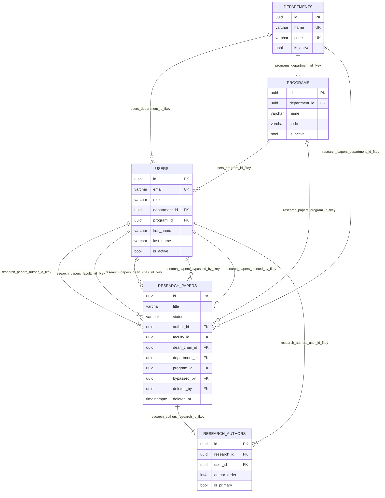

# ERD Full System (Part 1) - Core Structure

**Figure caption:** Core structural ERD of NUcleus showing institutional hierarchy (`departments` and `programs`), user placement, and foundational research ownership/authorship relations.
