# ERD Full System (Part 2) - Workflow and Communication

```mermaid
erDiagram
    USERS {
        uuid id PK
        varchar email UK
        varchar role
    }

    RESEARCH_PAPERS {
        uuid id PK
        varchar title
        varchar status
        uuid author_id FK
    }

    APPROVAL_WORKFLOW {
        uuid id PK
        uuid research_id FK
        uuid reviewer_id FK
        varchar reviewer_role
        varchar status
        varchar action_type
    }

    FACULTY_CONFLICT_DECLARATIONS {
        uuid id PK
        uuid faculty_id FK
        uuid research_id FK
    }

    RESEARCH_COMMENTS {
        uuid id PK
        uuid research_id FK
        uuid user_id FK
        uuid parent_id FK
        bool is_internal
    }

    CO_AUTHOR_INVITATIONS {
        uuid id PK
        uuid research_id FK
        uuid inviter_id FK
        uuid invitee_id FK
        text token UK
        text status
    }

    NOTIFICATIONS {
        uuid id PK
        uuid user_id FK
        uuid research_id FK
        varchar type
        bool is_read
    }

    PAPER_VIEWS {
        uuid id PK
        uuid paper_id FK
        uuid user_id FK
        timestamptz viewed_at
    }

    PAPER_DOWNLOADS {
        uuid id PK
        uuid paper_id FK
        uuid user_id FK
        timestamptz downloaded_at
    }

    SUBMISSION_DRAFTS {
        uuid id PK
        uuid user_id FK
        uuid paper_id FK
        jsonb draft_data
    }

    RESEARCH_PAPERS ||--|{ APPROVAL_WORKFLOW : "approval_workflow_research_id_fkey"
    USERS ||--|{ APPROVAL_WORKFLOW : "approval_workflow_reviewer_id_fkey"

    USERS ||--|{ FACULTY_CONFLICT_DECLARATIONS : "faculty_conflict_faculty_fkey"
    RESEARCH_PAPERS ||--|{ FACULTY_CONFLICT_DECLARATIONS : "faculty_conflict_research_fkey"

    RESEARCH_PAPERS ||--|{ RESEARCH_COMMENTS : "research_comments_research_id_fkey"
    USERS ||--|{ RESEARCH_COMMENTS : "research_comments_user_id_fkey"
    RESEARCH_COMMENTS ||--o{ RESEARCH_COMMENTS : "research_comments_parent_id_fkey"

    RESEARCH_PAPERS ||--|{ CO_AUTHOR_INVITATIONS : "co_author_invitations_research_id_fkey"
    USERS ||--|{ CO_AUTHOR_INVITATIONS : "co_author_invitations_inviter_id_fkey"
    USERS ||--|{ CO_AUTHOR_INVITATIONS : "co_author_invitations_invitee_id_fkey"

    RESEARCH_PAPERS ||--o{ NOTIFICATIONS : "notifications_research_id_fkey"
    USERS ||--|{ NOTIFICATIONS : "notifications_user_id_fkey"

    RESEARCH_PAPERS ||--o{ PAPER_VIEWS : "paper_views_paper_id_fkey"
    USERS ||--o{ PAPER_VIEWS : "paper_views_user_id_fkey"

    RESEARCH_PAPERS ||--o{ PAPER_DOWNLOADS : "paper_downloads_paper_id_fkey"
    USERS ||--o{ PAPER_DOWNLOADS : "paper_downloads_user_id_fkey"

    USERS ||--|{ SUBMISSION_DRAFTS : "submission_drafts_user_id_fkey"
    RESEARCH_PAPERS ||--o{ SUBMISSION_DRAFTS : "submission_drafts_paper_id_fkey"
```

**Figure caption:** Workflow and communication ERD showing review operations, collaboration, notifications, engagement tracking, and submission draft persistence around the research lifecycle.
