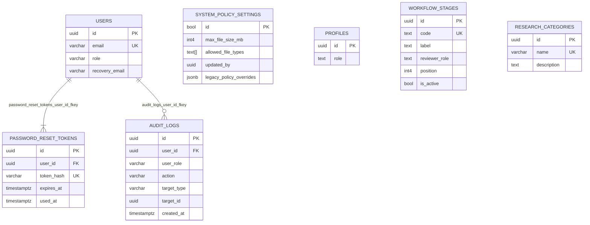

# ERD Full System (Part 3) - Governance and Platform

**Figure caption:** Governance and platform ERD showing account security and audit relations, alongside standalone policy and configuration tables without declared foreign keys in `public`.

## Verified Standalone Tables In This Partition

- `PROFILES` (no FK declared in `public`)
- `WORKFLOW_STAGES` (no FK declared in `public`)
- `RESEARCH_CATEGORIES` (no FK declared in `public`)
- `SYSTEM_POLICY_SETTINGS.updated_by` is not declared as a foreign key
