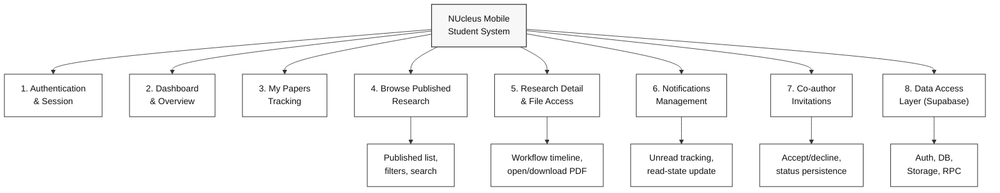

# HIPO Chart (Generalized) - NUcleus Mobile

**Figure caption:** Generalized HIPO hierarchy of NUcleus Mobile showing the major student-facing functional modules and the shared data access layer. The chart is intentionally high-level to present overall structure before module-specific decomposition.

## IPO Summary by Module

- **Authentication & Session**
  - Input: email/password, saved session token.
  - Process: validate sign-in, restore session, resolve student profile.
  - Output: authenticated student context, active or cleared session.

- **Dashboard & Overview**
  - Input: student paper records.
  - Process: aggregate status counts, sort recent papers.
  - Output: total/in-review/approved/revision metrics and recent list.

- **My Papers Tracking**
  - Input: own paper dataset, filter/search values.
  - Process: status filtering, text matching, recency ordering.
  - Output: filtered paper cards with workflow status indicators.

- **Browse Published Research**
  - Input: published papers, categories, query text.
  - Process: category selection, keyword/title/author search.
  - Output: browsable published research list.

- **Research Detail & File Access**
  - Input: selected paper ID, user action (open/download).
  - Process: load detail/workflow, resolve signed URL, track views/downloads.
  - Output: detailed paper view and PDF opened in browser.

- **Notifications Management**
  - Input: notification rows, read actions.
  - Process: unread counting, single/all read updates.
  - Output: updated notification feed and read status.

- **Co-author Invitations**
  - Input: invitation records, accept/decline actions.
  - Process: pending/expired evaluation, response persistence.
  - Output: updated invitation status and pending totals.

- **Data Access Layer (Supabase)**
  - Input: auth events, DB queries, storage path, RPC calls.
  - Process: data retrieval, secure URL generation, metric updates.
  - Output: normalized app data and persisted state changes.

## Legend

- **Hierarchy node**: a function or module in the HIPO structure.
- **Top node**: system boundary (NUcleus Mobile).
- **Lower nodes**: decomposed modules/subfunctions derived from project features.
