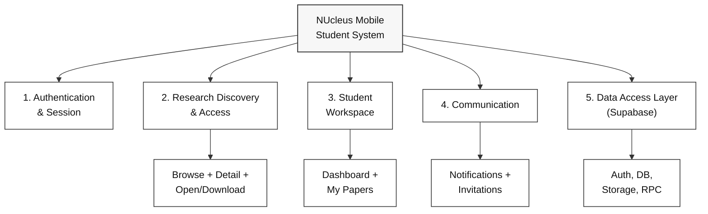
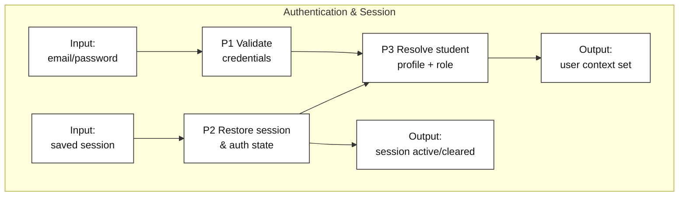
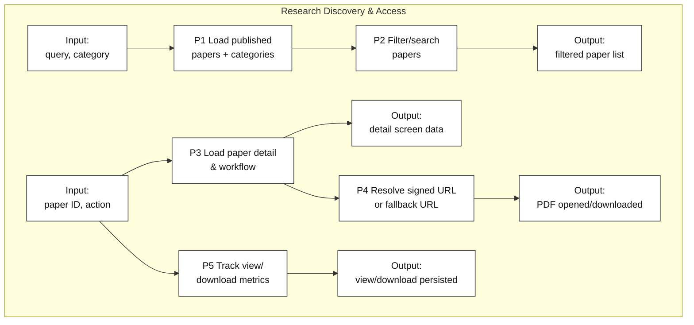
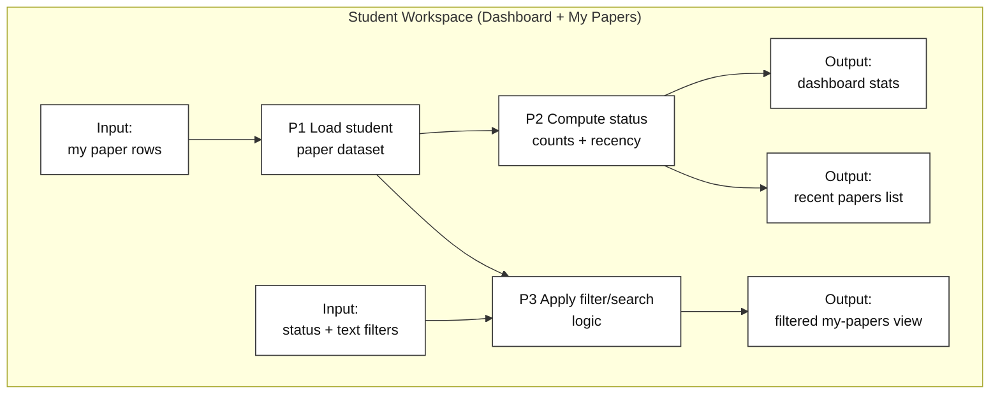
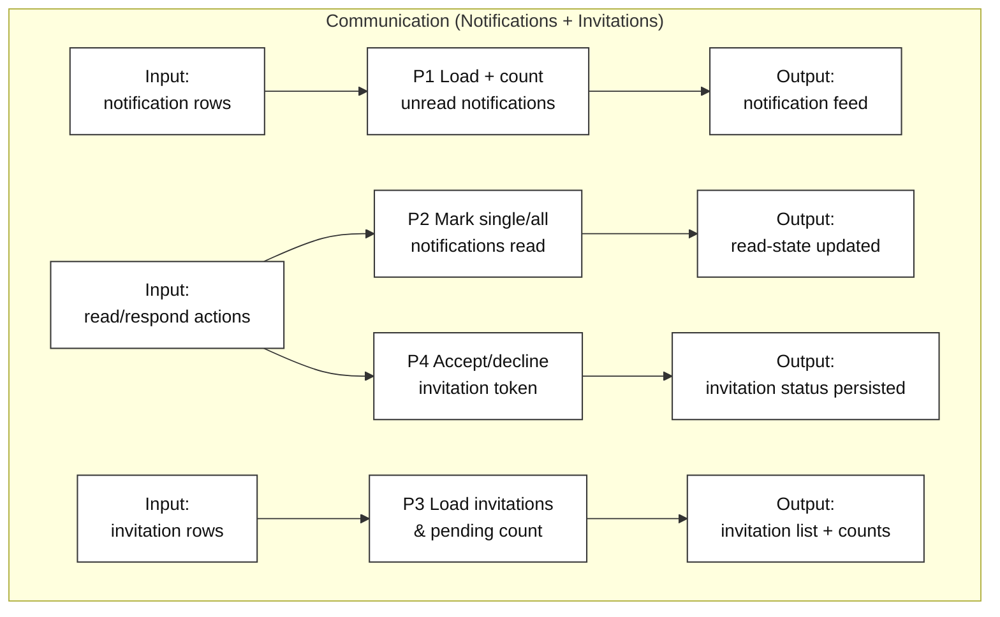
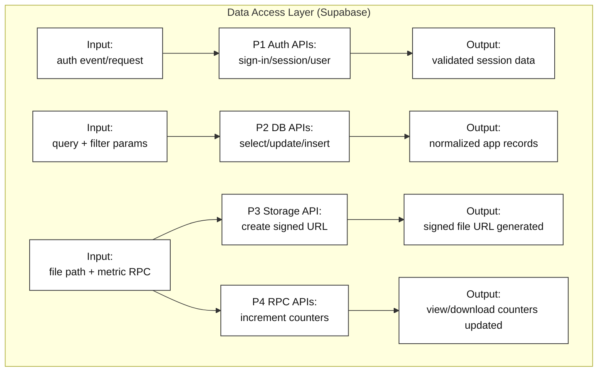

# HIPO Chart (Highlighted Modules) - NUcleus Mobile

## Level 0 HIPO Overview

**Figure caption:** Level 0 HIPO decomposition emphasizing five highlighted modules used in the NUcleus Mobile student workflow. This view is intended as the bridge between a generalized system map and process-specific IPO charts.

## Level 1 HIPO - Authentication & Session

**Figure caption:** Authentication flow from credentials/session input to profile validation and final user-context creation. The outputs reflect either an active student session or a cleared unauthorized session.

## Level 1 HIPO - Research Discovery & Access

**Figure caption:** Discovery and access module showing the complete browse-to-read path, including signed file URL resolution and engagement tracking. Outputs separate user-visible views from persisted analytics side effects.

## Level 1 HIPO - Student Workspace

**Figure caption:** Student workspace module focused on personal paper monitoring and retrieval. The chart highlights separation between computed dashboard aggregates and interactive filtered lists.

## Level 1 HIPO - Communication

**Figure caption:** Communication module decomposition for student alerts and co-author collaboration requests. Outputs distinguish immediate UI refresh from persisted response/update states.

## Level 1 HIPO - Data Access Layer (Supabase Operations)

**Figure caption:** Data access HIPO focused on Supabase integration points used by the mobile app: authentication, relational queries, storage URL signing, and RPC-based metric updates.

## Legend

- **Input nodes**: upstream data or user/system events entering a module.
- **Process nodes (P1, P2, ...)**: transformation or control steps inside the module.
- **Output nodes**: user-visible or persisted results produced by each process flow.
