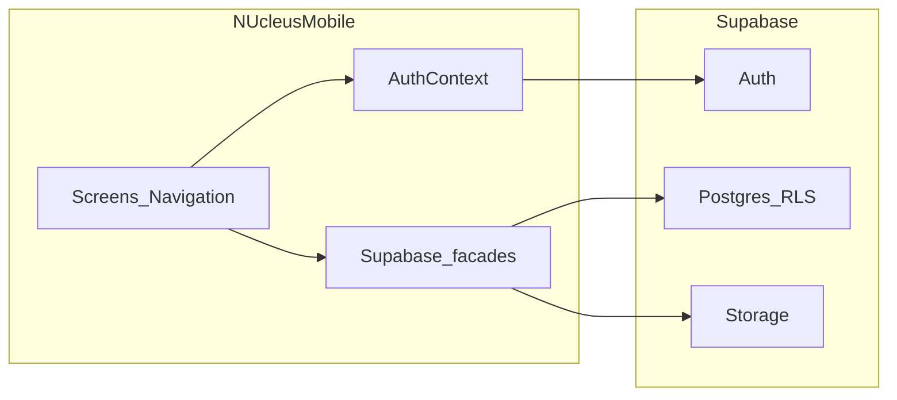

# [COMPLETED] NUcleus Mobile — Implementation Plan: Express → Direct Supabase

> **STATUS: FULLY EXECUTED AND MERGED**  
> *This migration plan has been successfully completed and merged into the `dev` branch. All phases are stable, the Express layer is entirely deprecated, and all RLS/UUID issues have been resolved. This document now serves as a historical record of the migration strategy and security policy adjustments.*

This plan describes how the React Native app was migrated from an **Express-backend API** architecture to **direct Supabase** integration (Auth, Postgres with RLS, Storage), incrementally and without a full rewrite.

**Canonical product context:** [PROJECT_CONTEXT.md](./PROJECT_CONTEXT.md)

**Constraints:**

- Do **not** add research **submission** workflow or non-student features.
- Prefer **incremental** replacement of the data layer; keep screens and navigation stable.
- Use the **web app** (`capstone-nucleus`) for schema, RLS, and workflow semantics; use the **Flutter app** (`capstone-nucleus-mobile`) for **how** direct Supabase is used on mobile (tables, queries, storage patterns).

---

## 1. Current architecture (as implemented)

### 1.1 HTTP and auth pipeline

- **Legacy Express Axios client:** removed in Phase 7 cleanup.
- **`src/storage/authStorage.ts`:** AsyncStorage keys for access and refresh tokens.
- **`src/context/AuthContext.tsx`:**  
  - **Sign-in:** `authApi.login` → stores tokens → sets `user`.  
  - **Bootstrap:** reads tokens → `authApi.getCurrentUser()` (`/auth/me`). On failure, clears tokens.

### 1.2 API modules (Express endpoints)

| Module | Responsibility | Current routes |
|--------|----------------|----------------|
| `src/api/auth.ts` | Login, register (unused in UI), refresh helper, current user, submission policy | `POST /auth/login`, `POST /auth/register`, `GET /auth/me`, `POST /auth/refresh`, `GET /auth/submission-policy` |
| `src/api/research.ts` | My papers, published browse, categories, detail + workflow, file URL, view/download tracking, profile data | `GET /research/my/papers`, `GET /research/published`, `GET /research/categories`, `GET /research/:id`, `GET /research/:id/file`, `POST /research/:id/view`, `POST /research/:id/download`, `GET /research/profile/data` |
| `src/api/notifications.ts` | List, unread count, mark read, mark all | `GET /auth/notifications`, `GET /auth/notifications/unread-count`, `PATCH /auth/notifications/:id/read`, `PATCH /auth/notifications/read-all` |
| `src/api/invitations.ts` | List, accept, decline | `GET /auth/co-author-invitations`, `POST .../accept`, `POST .../decline` |
| `src/api/helpers.ts` | `unwrapApiData`, Express-style `getApiErrorMessage` | N/A |

### 1.3 UI consumers (preserve behavior)

- **Auth:** `LoginScreen`, `UnsupportedRoleScreen`, `AppNavigator` gating.
- **Research:** `BrowseScreen`, `MyPapersScreen`, `DashboardScreen`, `ResearchDetailScreen` (detail, workflow, `trackView`, `getResearchFile`, `trackDownload` for open flow).
- **Notifications / invitations:** `NotificationsScreen`, `InvitationsScreen`.

### 1.4 Dependency inventory

- **No** `@supabase/supabase-js` in `package.json` today.
- **Axios** is the sole HTTP client for backend calls.

---

## 2. Target architecture

### 2.1 High-level



- One **Supabase client** (recommended location: e.g. `src/lib/supabase.ts`), created with `createClient(url, anonKey, { auth: { storage: AsyncStorageAdapter, ... } })` following current Supabase docs for React Native / Expo.
- **Auth:** `signInWithPassword`, `signOut`, `onAuthStateChange` for session lifecycle.
- **Data:** PostgREST selects/updates or RPCs permitted by RLS—exact queries must match **web + Flutter** (`research_papers`, `users`, `research_categories`, etc., as used in Flutter `supabase_service.dart`).
- **Storage:** Bucket access consistent with web policies (Flutter references bucket name `research-papers` and table `research_papers`).

### 2.2 Preserve vs replace

| Preserve | Replace / refactor |
|----------|---------------------|
| Screen components and **navigation** structure (`AppNavigator`, route types) | `src/api/http.ts` and Axios interceptors |
| **Domain types** in `src/types/domain.ts` (map DB rows → these shapes) | Manual JWT refresh + `/auth/refresh` |
| **AuthContext API surface** (`signIn`, `signOut`, `user`, `loading`, `refreshCurrentUser`) — keep signatures where possible | Implementation: swap internals to Supabase; token storage may delegate to Supabase session |
| Student-only **role guard** | Supabase env only (`EXPO_PUBLIC_SUPABASE_URL` / `EXPO_PUBLIC_SUPABASE_ANON_KEY`) |
| Module names as **facades** (`researchApi`, `notificationsApi`, …) reimplemented with Supabase | `getApiErrorMessage` / `unwrapApiData` for Express responses |

---

## 3. Phased migration (incremental)

### Phase 0 — Discovery (no app release dependency)

- In **web** repo: locate schema (migrations, types, or admin SQL), RLS policies, and any **RPCs** the web uses for view/download counts, notifications, invitations.
- In **Flutter** `lib/data/services/supabase_service.dart` and `research_repository.dart`: document table names, filters for “published” vs “my papers”, and storage URL construction.
- Produce a short **internal** mapping from each Express route to the chosen Supabase operation (see section 4). Adjust this plan’s table if the web uses views or RPCs not visible in Flutter.

### Phase 1 — Foundation

- Add `@supabase/supabase-js` (and any official AsyncStorage auth helper if recommended for your Expo version).
- Add `EXPO_PUBLIC_SUPABASE_URL` and `EXPO_PUBLIC_SUPABASE_ANON_KEY` to `.env.example` and document in README.
- Implement `createClient` with persistent auth.
- **Do not** remove Express yet: either keep both during development or use a **feature flag** / branch strategy so the app can be tested phase-by-phase.

**Exit criteria:** App builds; Supabase client initializes; no user-facing change required yet.

### Phase 2 — Auth and session

✅ **FULLY COMPLETE (stable)**

- ✅ Replaced `authApi.login` with `supabase.auth.signInWithPassword`
- ✅ Implemented strict profile resolution from `public.users` by email (fixed schema: use `first_name`, `middle_name`, `last_name`, not `full_name`)
- ✅ Removed temporary fallback profile generation; missing `public.users` row now cleanly fails auth instead of fabricating a profile
- ✅ Enforces **student-only** after profile load (checked before navigation)
- ✅ **Bootstrap:** uses `onAuthStateChange` with AsyncStorage session persistence (no Express `/auth/me`); rejects sessions if profile row is not readable through RLS
- ✅ **Sign out:** `supabase.auth.signOut()` with app state cleanup
- ✅ Removed Express `authApi` dependency from AuthContext
- ✅ Auth → `public.users` join is **email-based**, aligned with web backend provisioning contract

**Exit criteria met:** Login, cold start session restore, sign-out, student gate, and profile lookup are all working with strict email-based resolution and RLS-backed access; TypeScript clean. **Fallback behavior is no longer part of the normal auth path.**

### Phase 2 root cause resolution

- The failure was **not** missing user provisioning: the `public.users` row existed.
- The root cause was a missing **SELECT policy** on `public.users`.
- The web backend continued to work because it uses the Supabase **service role**, which bypasses RLS.
- The React Native app failed because it uses the Supabase **anon key**, which is governed by RLS.

### Final auth architecture

- Mobile uses **Supabase Auth + anon key** for sign-in and session restoration.
- Access to `public.users` is controlled by **RLS policies**.
- The web backend continues using the **service role** and is unaffected by mobile RLS policy changes.
- Email-based profile resolution is the confirmed canonical join strategy for the app.

### Security validation

- The mobile app must **not** use the service role key.
- The anon key + RLS model is the secure production pattern for React Native.
- The added SELECT policy is intentionally narrow so each authenticated user can read only their own profile.

### Phase 3 — Research lists and detail

✅ **COMPLETED (stable)**

- ✅ Replaced `researchApi` Express calls with a Supabase facade for research lists and detail.
- ✅ `getMyPapers` scopes papers to the signed-in student by author.
- ✅ `getPublishedPapers` returns browseable papers with `approved` and `published` statuses.
- ✅ `getCategories` loads category labels from `research_categories`.
- ✅ `getResearchById` returns paper detail plus `approval_workflow` history.

**Exit criteria met:** Browse, My Papers, Dashboard, and Research Detail now load from Supabase. TypeScript is clean, and research data is no longer routed through Express.

### Phase 4 — Views, downloads, and files

✅ **COMPLETED (stable)**

**Working:**
- ✅ PDF open flow end-to-end: file URL resolution, signed URL creation with fallback to public URL
- ✅ `trackView` fires on PDF open tap; `trackDownload` fires on "Open + Track Download" tap
- ✅ RPC calls execute without error (confirmed via RPC parameter fix: `row_id` parameter name)
- ✅ Audit table inserts (`paper_views`, `paper_downloads`) complete successfully
- ✅ Download gating (`allow_download` flag) enforced; blocks download action with error message
- ✅ All operations use anon key + RLS model
- ✅ Signed URL creation includes 1-hour expiration; gracefully falls back to public URL on failure
- ✅ Error handling preserves existing UX: view tracking failures don't block file open, download validation errors show user-facing messages

**Resolved (post-Phase 7 external fixes):**
- ✅ `increment_view_count` and `increment_download_count` updated to `SECURITY DEFINER` with `SET search_path = public`
- ✅ `paper_views` and `paper_downloads` insert policies updated to email-based identity resolution
- ✅ View and download counts now increment and persist after navigation
- ✅ Backups saved in [docs/sql/increment_count_rpcs_original.sql](docs/sql/increment_count_rpcs_original.sql), [docs/sql/paper_views_rls_original.sql](docs/sql/paper_views_rls_original.sql), and [docs/sql/paper_downloads_rls_original.sql](docs/sql/paper_downloads_rls_original.sql)

**Exit criteria met:** PDF open flow and file access are fully functional, and view/download counts now persist correctly after navigation.

### Phase 5 — Notifications

✅ **COMPLETED (stable)**

- ✅ Replaced `notificationsApi` Express calls with a Supabase facade backed by the `notifications` table
- ✅ `getNotifications` / `getMine` loads the signed-in student’s notifications ordered by `created_at` descending with a default limit of 100
- ✅ `getUnreadCount` returns the signed-in student’s unread notification count
- ✅ `markAsRead` / `markRead` updates a single notification row by id for the signed-in student
- ✅ `markAllAsRead` / `markAllRead` updates all unread notifications for the signed-in student
- ✅ `NotificationsScreen` continues to show unread indicators and mark-read actions without Express dependencies
- ✅ RLS SELECT and UPDATE policies are already in place for `notifications`

**Exit criteria met:** `NotificationsScreen` loads from Supabase, unread count displays correctly, mark-read actions persist, and no notification path relies on Express.

**Post-implementation discoveries (important):**

- **Root cause (UUID mismatch):** The `notifications` table stores `user_id` using the `public.users` UUID, while `auth.uid()` returns the `auth.users` UUID. Existing RLS policies that compared `user_id = auth.uid()` therefore returned no rows on mobile, producing silently empty result sets even though RPCs/queries executed without error.

- **Fix applied:** Replaced `notifications` RLS policies with email-based resolution consistent with Phase 2 auth patterns. The new policies resolve the `public.users` id by matching `public.users.email = auth.email()` before comparing to `user_id`. The original policies were saved to `docs/sql/notifications_rls_original.sql` before replacement.

Example of the applied SQL (already applied in the environment):

```sql
DROP POLICY "Users can read own notifications" ON public.notifications;

CREATE POLICY "Users can read own notifications"
ON public.notifications
FOR SELECT
USING (
  user_id = (
    SELECT u.id FROM public.users u
    WHERE u.email = auth.email()
  )
);

DROP POLICY "Users can update own notifications" ON public.notifications;

CREATE POLICY "Users can update own notifications"
ON public.notifications
FOR UPDATE
USING (
  user_id = (
    SELECT u.id FROM public.users u
    WHERE u.email = auth.email()
  )
)
WITH CHECK (
  user_id = (
    SELECT u.id FROM public.users u
    WHERE u.email = auth.email()
  )
);
```

- **Validation:** Notifications now load per-user, unread counts are accurate, `markAsRead` and `markAllAsRead` persist correctly, and the `NotificationsScreen` no longer depends on Express.

- **Resolved (post-Phase 7 external fix):** `research_papers` RLS policies now use email-based identity resolution, so students can see their papers across all statuses. The original policies are backed up in [docs/sql/research_papers_rls_original.sql](docs/sql/research_papers_rls_original.sql).

**Notes / next steps:**

- The original RLS SQL for `notifications` is stored at [docs/sql/notifications_rls_original.sql](docs/sql/notifications_rls_original.sql). Use this file to review the previous policy definitions if needed.
- Do not proceed with Phase 6 until you are ready; Phase 5 is documented as complete with the above caveats.
 

### Phase 6 — Co-author invitations

✅ **COMPLETED (stable)**

- ✅ Replaced `invitationsApi` Express calls with a Supabase facade backed by `co_author_invitations`
- ✅ `getInvitations` / `getMine` loads the signed-in student’s invitations scoped by `invitee_id`
- ✅ `acceptInvitation` / `declineInvitation` update `status` and set `responded_at` using an ISO timestamp
- ✅ Uses email-resolved identity pattern consistent with Phase 5 (profile id from `public.users`)
- ✅ Accept and decline confirmed working end to end — changes persist in the database

**Resolved (post-Phase 7 updates):**
- ✅ PostgREST joins for `research` and `inviter` are now enabled after the `research_papers` RLS fix and the updated embed select in [src/api/invitations.ts](src/api/invitations.ts)
- ✅ `INVITATION_SELECT` matches the actual schema columns (`id`, `research_id`, `inviter_id`, `invitee_id`, `invitee_email`, `token`, `status`, `expires_at`, `created_at`, `responded_at`, `updated_at`)

**Exit criteria met:** `InvitationsScreen` loads from Supabase, accept and decline persist correctly, and no invitation path relies on Express.

### Phase 7 — Cleanup and documentation

✅ **COMPLETED (stable)**

- ✅ Deleted Express client modules: [src/api/http.ts](src/api/http.ts), [src/api/helpers.ts](src/api/helpers.ts), [src/api/auth.ts](src/api/auth.ts)
- ✅ Removed legacy Express base URL config from [src/config/env.ts](src/config/env.ts)
- ✅ Trimmed auth token storage to live usage: [src/storage/authStorage.ts](src/storage/authStorage.ts) now only exports `clearAuthTokens`
- ✅ Removed all Axios usage and uninstalled the dependency

**Exit criteria met:** No remaining Express code paths or config; Axios removed; app uses Supabase-only flow.

### Post-Phase 7 updates (external fixes and code changes)

✅ **COMPLETED — All three deferred issues resolved**

#### Issue #1 — View/Download count persistence (FIXED)

**Root cause:** Counter RPCs (`increment_view_count`, `increment_download_count`) were silently updating 0 rows because:
1. The underlying `UPDATE` on `research_papers` was blocked by the UPDATE policy when called under the anon key
2. `paper_views` and `paper_downloads` INSERT policies were preventing audit rows from being inserted

**External Supabase fixes:**
- `increment_view_count` and `increment_download_count` changed from `SECURITY INVOKER` to `SECURITY DEFINER` with `SET search_path = public` so they execute with schema owner permissions
- `paper_views` and `paper_downloads` INSERT policies replaced with email-based identity resolution pattern (consistent with Phase 5 notifications fix)
- Original RPC definitions backed up in [docs/sql/increment_count_rpcs_original.sql](docs/sql/increment_count_rpcs_original.sql)
- Original policies backed up in [docs/sql/paper_views_rls_original.sql](docs/sql/paper_views_rls_original.sql) and [docs/sql/paper_downloads_rls_original.sql](docs/sql/paper_downloads_rls_original.sql)

**Validation:** View and download counts now increment correctly when papers are opened; counts persist in the database and are visible on refresh.

#### Issue #2 — Research papers UUID mismatch (FIXED)

**Root cause:** `auth.uid()` ownership checks on `research_papers` silently failed under the anon key because the mobile client's `auth.users.id` (from Supabase Auth) did not match the UUIDs stored in `public.users` on the same record. This caused students to be unable to see their own papers in any status.

**External Supabase fixes:**
- All three `research_papers` RLS policies (INSERT, SELECT, UPDATE) replaced with email-based identity resolution pattern:
  - Identity resolved as `SELECT u.id FROM public.users u WHERE u.email = auth.email()`
  - Students can now see all their papers regardless of approval status
- Original policies backed up in [docs/sql/research_papers_rls_original.sql](docs/sql/research_papers_rls_original.sql)

**Validation:** Students now see their papers in My Papers view across all statuses; Dashboard counts are accurate.

#### Issue #3 — Invitation card blank fields (FIXED)

**Root cause:** Invitation cards showed "Untitled Research" and "Unknown" because:
1. `INVITATION_SELECT` never requested the `research` and `inviter` joins
2. PostgREST joins on `research_papers` were blocked by the UUID mismatch RLS issue (see Issue #2)
3. PostgREST join on `users` (for inviter name) caused infinite RLS recursion (error 42P17) when expanding the users policy for this use case

**External Supabase fixes:**
- `research_papers` SELECT policy updated to add co-author invitee read condition: invitees can read papers they were invited to regardless of approval status
  - Original policy backed up in [docs/sql/research_papers_rls_co_author_read_pre_fix.sql](docs/sql/research_papers_rls_co_author_read_pre_fix.sql)
- New `get_user_basic_info(user_id uuid)` SECURITY DEFINER function created to safely resolve inviter profile info without triggering `users` RLS recursion
  - Original users policy backed up in [docs/sql/users_rls_pre_inviter_read_fix.sql](docs/sql/users_rls_pre_inviter_read_fix.sql)

**Code changes:**
- `INVITATION_SELECT` updated to include PostgREST embed for `research` via `co_author_invitations_research_id_fkey`
- `inviter` PostgREST join removed from `INVITATION_SELECT` to avoid RLS recursion
- `loadInvitations()` now builds a unique inviter ID map and calls `get_user_basic_info` RPC for each inviter (minimizing RPC calls per load)
- `toInvitation()` updated to accept resolved inviter as a second parameter
- Changes in [src/api/invitations.ts](src/api/invitations.ts)

**Validation:** Invitation cards now display research title and inviter name correctly; accepts and declines persist as before.

---

## 4. API → Supabase replacement matrix

Use this as a **checklist**. Phases 0–3 now complete; Phase 4 begins below.

**Phase 2 (Auth) — COMPLETED:**
| Express (current) | Role | Supabase approach | Status |
|-------------------|------|-------------------|--------|
| `POST /auth/login` | Auth | `auth.signInWithPassword` + profile `select` on `users` | ✅ Done |
| `POST /auth/refresh` | Token refresh | Supabase client handles refresh automatically | ✅ Done |
| `GET /auth/me` | Current user | Session + profile query via `fetchAppUserProfile()` | ✅ Done |

**Phase 3+ (Data) — IN PROGRESS:**

| Express (current) | Role | Supabase approach | Status |
|-------------------|------|-------------------|--------|
| `POST /auth/register` | Register | **Out of mobile V1 scope** unless product adds register screen | ⏳ Not needed |
| `GET /auth/submission-policy` | Submission config | **Remove** (submission excluded from mobile) | ⏳ Not needed |

**Phase 3–4 (Research, files):**
| Express (current) | Role | Supabase approach | Status |
|-------------------|------|-------------------|--------|
| `GET /research/my/papers` | My papers | `select` on `research_papers` filtered by author | ✅ Done |
| `GET /research/published` | Browse | `select` with published/approved filters | ✅ Done |
| `GET /research/categories` | Categories | `select` on `research_categories` | ✅ Done |
| `GET /research/:id` | Detail + workflow | `select` + workflow query or view | ✅ Done |
| `GET /research/:id/file` | File URL | Storage signed URL | ✅ Done |
| `POST /research/:id/view` | View tracking | Insert/RPC per web | ✅ Done |
| `POST /research/:id/download` | Download tracking | Insert `paper_downloads` or RPC | ✅ Done |
| `GET /research/profile/data` | Profile analytics | Optional: remove if unused | ⏳ Later |
| `GET /auth/notifications` | List | `select` on notifications table | ✅ Done |
| `GET /auth/notifications/unread-count` | Count | `count()` query | ✅ Done |
| `PATCH /auth/notifications/:id/read` | Mark read | `update` row | ✅ Done |
| `PATCH /auth/notifications/read-all` | Mark all | `update` batch or RPC | ✅ Done |
| `GET /auth/co-author-invitations` | List | `select` on invitation table | ✅ Done |
| `POST .../:token/accept` | Accept | `update` / RPC | ✅ Done |
| `POST .../:token/decline` | Decline | `update` / RPC | ✅ Done |

---

## 5. Auth and session (technical notes)

- **Listeners:** Subscribe to `onAuthStateChange` in one place (often near root or inside `AuthProvider`) to keep `user` in sync when tokens refresh or session expires.
- **Profile vs auth user:** Supabase Auth `user.id` may align with `users.id` in your schema—confirm in web migrations. If email is the join key, handle case normalization consistently with Flutter (`ilike` patterns).
- **Non-student roles:** After loading profile, if `role !== 'student'`, navigate to **Unsupported Role** without granting tab access (existing navigator logic).

---

## 6. Storage and PDF handling

- Mirror Flutter: resolve storage path from `research_papers` (or equivalent) and build **signed** or **public** URL for bucket **`research-papers`** (name from Flutter codebase; confirm in web).
- Respect `allow_download` / policy: if the web blocks download, mobile must not bypass RLS or bucket policies.
- Keep **`expo-web-browser`** (or current approach) for opening URLs unless product mandates an in-app PDF viewer later.

---

## 7. Notifications and invitations

- **Notifications:** Implement server-compatible updates so unread counts and read state remain consistent with web and other clients.
- **Invitations:** Accept/decline must match server-side state machine (pending → accepted/declined/expired) and any token validation the web enforces.

If Flutter’s notification UI is **derived** from papers rather than a dedicated table, prefer the **web** model for RN to stay aligned with the production schema.

---

## 8. Obsolete abstractions to remove (end state)

- `src/api/http.ts` (entire Axios + refresh interceptor).
- Express-specific response unwrapping where responses no longer exist.
- Duplicate token lifecycle if fully superseded by Supabase Auth session.

---

## 9. Validation and testing strategy

After **each phase**:

1. **TypeScript:** `npx tsc --noEmit` (add a `npm run typecheck` script if helpful).
2. **Manual smoke:**
   - Login / session restore / sign-out  
   - Non-student account → Unsupported Role  
   - Browse + filters, Research Detail, PDF open  
   - My Papers + Dashboard stats  
   - Notifications (read / mark all)  
   - Invitations (accept / decline)

Optional later: unit tests for Supabase facade functions with mocked client—only after the API surface stabilizes.

---

## 10. Non-goals (explicit)

- No **submission** or draft management on mobile.
- No **faculty/admin** surfaces.
- No **big-bang** rewrite: screens and navigation stay; **replace implementation** behind facades.

---

## 11. Reference files in this repo

| File | Migration relevance |
|------|---------------------|
| `src/api/http.ts` | Remove after migration (Phase 7) |
| `src/api/auth.ts` | ✅ No longer used (Phase 2 complete) |
| `src/api/research.ts` | Rewrite to Supabase (Phase 3) |
| `src/api/notifications.ts` | Rewrite to Supabase (Phase 5) |
| `src/api/invitations.ts` | Rewrite to Supabase (Phase 6) |
| `src/context/AuthContext.tsx` | ✅ Rewired to Supabase (Phase 2 complete) |
| `src/storage/authStorage.ts` | Shrink or remove (Phase 7) |
| `src/config/env.ts` | ✅ Updated with Supabase env vars (Phase 2 complete) |

---

## 12. Success criteria (project level)

- Mobile runs **without** a running Express server.
- Auth and data use **Supabase** with RLS behaving like web for student actions.
- Student-only scope and **no submission workflow** preserved.
- [PROJECT_CONTEXT.md](./PROJECT_CONTEXT.md) remains accurate as the living **canonical** description of the app.
