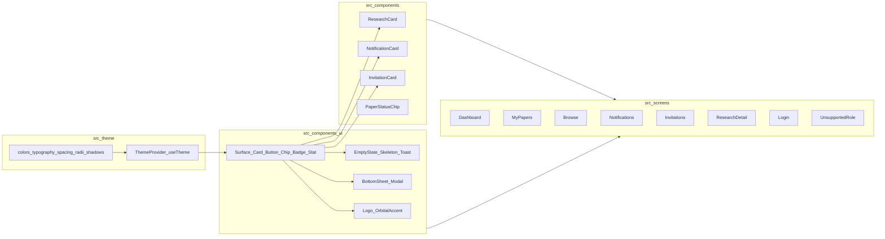

# [IN PROGRESS] NUcleus Mobile — Implementation Plan: UI Overhaul

> **STATUS: IN PROGRESS** — Phases 1–3 complete. Phases 4–10 not started.
> *This plan describes a UI-only overhaul of the NUcleus Mobile React Native Expo app on branch `feat/ui-overhaul`. It re-grounds every visible surface in the brand identity and the design system defined in [docs/PRODUCT_ROADMAP.md](../PRODUCT_ROADMAP.md), without touching the data layer, navigation contracts, or domain types. The Supabase migration is fully complete and stable; the data path is frozen for the duration of this work.*

**Canonical product context:** [PROJECT_CONTEXT.md](../PROJECT_CONTEXT.md)

**Primary design reference:** [PRODUCT_ROADMAP.md](../PRODUCT_ROADMAP.md)

**Migration history (do not reopen):** [SUPABASE_MIGRATION.md](./SUPABASE_MIGRATION.md)

---

## 1. Constraints (must hold for every phase)

- **Do not touch the data layer.** [src/api/research.ts](../../src/api/research.ts), [src/api/notifications.ts](../../src/api/notifications.ts), [src/api/invitations.ts](../../src/api/invitations.ts), [src/context/AuthContext.tsx](../../src/context/AuthContext.tsx), [src/lib/supabase.ts](../../src/lib/supabase.ts), [src/auth/fetchAppUserProfile.ts](../../src/auth/fetchAppUserProfile.ts), [src/auth/mapSupabaseAuthError.ts](../../src/auth/mapSupabaseAuthError.ts), and [src/storage/authStorage.ts](../../src/storage/authStorage.ts) are frozen.
- **Do not change domain shapes.** [src/types/domain.ts](../../src/types/domain.ts) is frozen.
- **Do not rename or restructure navigation.** [src/navigation/AppNavigator.tsx](../../src/navigation/AppNavigator.tsx) and [src/navigation/types.ts](../../src/navigation/types.ts) keep their route names, route params, tab order, and gating logic. Visual styling of the navigator (tab bar, header) is the only navigator-level change permitted.
- **Do not modify** [docs/PROJECT_CONTEXT.md](../PROJECT_CONTEXT.md) **or** [docs/PRODUCT_ROADMAP.md](../PRODUCT_ROADMAP.md).
- **Brand palette is the anchor.** Colors are derived directly from the official NUcleus logo and the roadmap's color system; no off-brand colors are introduced.
- **No new product scope.** The roadmap's "Future Enhancements" (§6) are explicitly out of scope for this overhaul, except for the items that read as polish/accessibility (contrast, dynamic type, reduced motion, micro-interactions). Reading-mode redesign, night mode, in-app PDF viewer, long-press quick actions, and inline annotations are out of scope.
- **Run** `npx tsc --noEmit` **after every code change.** A green typecheck is part of every phase's exit criteria.
- **Commits are not part of this plan.** Commit messages and merge mechanics are handled separately.

---

## 2. Brand and design foundation (anchor)

The brand identity is fixed by the official NUcleus logo and is the source of all primary design tokens. The roadmap's [§2 Design System](../PRODUCT_ROADMAP.md#2-design-system) governs how these tokens are applied.

### 2.1 Palette (from the logo)

> **Working values, pending brand confirmation.** The hex values below are the agreed starting points and are subject to fine-tuning at any point during the overhaul. They are not locked. If a confirmed brand swatch arrives mid-phase, the change is a single edit in `src/theme/colors.ts` and propagates everywhere automatically — that propagation is the whole purpose of Phase 1.

- **Primary navy** — the deep blue of the "N" letterform. Working value: `#1B3A8C`. Used for primary CTAs, navigation emphasis, brand surfaces, and links per roadmap §2 ("blue family for primary UI elements, navigation, and links").
- **Royal blue (mid-tone)** — the lighter blue segment of the orbital swoosh. Used for hover/pressed/active states and decorative gradient stops on brand-only surfaces. Working value: `#2E5BC9` (`palette.navy[400]`), pending brand confirmation and subject to fine-tuning.
- **Accent gold** — the warm amber/gold of the orbital swoosh and orb. Working value: `#F5A623`. Reserved per roadmap §2 for "highlights, micro-interactions, and important affordances (actions, status badges)" — never decorative.
- **Neutrals** — clean whites for primary surfaces, soft cool-grays for secondary surfaces and dividers, slate ink for body and headings. Maps directly to roadmap §2 "Neutrals".

### 2.2 Typography (decisions, mapped to roadmap §2)

- **Primary UI font: Outfit** (humanist sans), loaded via `expo-font`. Used for **all** UI surfaces: tab bar, headers, screen titles, section headings, body copy, metadata, buttons, chips, badges, form labels, and inputs. Outfit carries the entire UI vocabulary.
- **Display / accent font: Lora** (serif), loaded via `expo-font`. Used **sparingly** for premium typographic treatments where content is the focus: the paper title in `ResearchDetail` and any other reading-focused surfaces. This realizes roadmap §2's note that a serif may be considered "for printed-style titling in premium views."
- **Lora is never used for UI chrome** — no Lora in the tab bar, navigation headers, buttons, chips, form labels, metadata, or list-row titles. Outfit owns those surfaces. Lora's job is editorial weight, not interface text.
- **Designerly balance.** Outfit and Lora pair on a small number of surfaces — primarily `ResearchDetail`'s reading view, where the title is Lora and everything around it (status chip, metadata, action buttons, abstract section header) stays Outfit. The intent is that Lora reads as content and Outfit reads as the application around it.
- **Type scale.** Strong scale across display, h1, h2, h3, body, bodyStrong, metadata, caption — tuned for mobile reading per roadmap §2 ("strong scale between headings, subheads, body, and metadata; line lengths and sizes tuned for mobile reading"). Left-aligned body copy; consistent metadata sizing.
- **Loading.** Both fonts are registered via `expo-font` in [App.tsx](../../App.tsx) and gated behind a single splash/loading state so the app never paints before the type system is ready. The existing `FullScreenLoader` pattern is the model.

### 2.3 Surface and motion rules (from roadmap §2 + §3)

- Soft elevation via gentle shadows; no heavy borders.
- Subtle glass/translucent surfaces only for transient overlays (modals, bottom sheets).
- Short-duration easing for reveal/hide; no long or attention-grabbing animations.
- **Animation runtime: React Native core only.** Motion is implemented with `Animated`, `LayoutAnimation`, and `Pressable` feedback. **`react-native-reanimated` is excluded for this overhaul.** It may be revisited in Phase 9 if a specific native-feel interaction proves limiting under core APIs; that revisit is a scoped exception, not a default.

### 2.4 Orbital motif

The orbital arc is a brand element and informs subtle decorative or motion details (active-tab indicator, splash/loader pulse, login mark). It is never used as primary content chrome.

---

## 3. Target architecture

### 3.1 Module layout

### 3.2 Preserve vs replace

| Preserve | Replace / refactor |
|----------|---------------------|
| Route names, route params, tab order in [src/navigation/types.ts](../../src/navigation/types.ts) | Inline `StyleSheet` literals and hard-coded hex values in every screen |
| Data fetching, RLS contracts, error semantics from `src/api/*` | Ad-hoc loading text, ad-hoc empty states, ad-hoc error strings — replaced by shared components |
| Domain shapes in [src/types/domain.ts](../../src/types/domain.ts) | Hard-coded chrome colors in tab bar / headers — replaced by themed navigator config |
| `AuthContext` API surface and `signIn` / `signOut` behavior | Logout placement and styling inside `DashboardScreen` (visual only; `signOut()` call is unchanged) |

---

## 4. Note on Login and UnsupportedRole

The user's per-screen scope is explicitly the six listed screens (Dashboard, MyPapers, Browse, Notifications, Invitations, ResearchDetail). [src/screens/auth/LoginScreen.tsx](../../src/screens/auth/LoginScreen.tsx) and [src/screens/auth/UnsupportedRoleScreen.tsx](../../src/screens/auth/UnsupportedRoleScreen.tsx) are not first-class overhaul phases. They are migrated to the new tokens and primitives as part of Phase 2 (Component System) so that no screen is left on legacy chrome, but they receive no bespoke layout redesign in this plan. Reviewers can promote them to a dedicated phase if desired.

---

## 5. Phased plan

Each phase declares scope, what is explicitly **not** changing, exit criteria, and a status field. Current state: Phases 1–3 are complete; Phases 4–10 are not started.

### Phase 1 — Design system foundation

✅ **COMPLETED (stable)**

**Implementation summary**

- ✅ Created [src/theme/colors.ts](../../src/theme/colors.ts), [src/theme/typography.ts](../../src/theme/typography.ts), [src/theme/spacing.ts](../../src/theme/spacing.ts), [src/theme/shadows.ts](../../src/theme/shadows.ts), and [src/theme/index.ts](../../src/theme/index.ts) as the Phase 1 design-token foundation.
- ✅ Delivered fonts via `@expo-google-fonts/outfit` and `@expo-google-fonts/lora` using `npx expo install` instead of raw TTF files, with the same runtime result and zero manual font file management.
- ✅ Registered Outfit + Lora in [App.tsx](../../App.tsx) and gated app render behind `fontsReady`.
- ✅ Mounted `AuthProvider` inside the `fontsReady` branch so auth UI did not render before typography was ready.
- ✅ Tightened font-weight typing to `NonNullable<TextStyle['fontWeight']>` to resolve a strict-mode typing issue.
- ✅ Resolved the royal blue working mid-tone to `palette.navy[400] = #2E5BC9` (still subject to fine-tuning).
- ⏳ Deferred `useTheme()`/provider and `src/theme/motion.ts` to later phases and documented the deferment in this plan.

**Implementation decisions**

- Font packaging used Expo Google Fonts modules (`@expo-google-fonts/*`) rather than manually checked-in TTF assets.
- Theme consumption in this phase remained direct (`import { theme } from 'src/theme'`) without context boilerplate.
- Deferred token/provider work was intentionally split so Phase 1 only delivered the approved foundational scope.

**Exit criteria met:**

- ✅ The five Phase 1 theme files existed and exported typed tokens.
- ✅ Outfit and Lora loaded correctly before app UI rendered.
- ✅ `npx tsc --noEmit` — green.
- ✅ No screen, navigation, data-layer, or domain-type files were changed.

---

### Phase 2 — Component system

✅ **COMPLETED (stable)**

**Implementation summary**

- ✅ Added [src/theme/radii.ts](../../src/theme/radii.ts) with `sm / md / lg / pill` tokens and exported it through [src/theme/index.ts](../../src/theme/index.ts).
- ✅ Created UI primitives in `src/components/ui/`: [Surface.tsx](../../src/components/ui/Surface.tsx), [Card.tsx](../../src/components/ui/Card.tsx), [Button.tsx](../../src/components/ui/Button.tsx), [Chip.tsx](../../src/components/ui/Chip.tsx), [Badge.tsx](../../src/components/ui/Badge.tsx), [Stat.tsx](../../src/components/ui/Stat.tsx), [IconButton.tsx](../../src/components/ui/IconButton.tsx), [EmptyState.tsx](../../src/components/ui/EmptyState.tsx), [Skeleton.tsx](../../src/components/ui/Skeleton.tsx), [InlineNotice.tsx](../../src/components/ui/InlineNotice.tsx), [BottomSheet.tsx](../../src/components/ui/BottomSheet.tsx), [Divider.tsx](../../src/components/ui/Divider.tsx), [Logo.tsx](../../src/components/ui/Logo.tsx), [OrbitalAccent.tsx](../../src/components/ui/OrbitalAccent.tsx), and [index.ts](../../src/components/ui/index.ts).
- ✅ Built feature components in `src/components/`: [ResearchCard.tsx](../../src/components/ResearchCard.tsx), [NotificationCard.tsx](../../src/components/NotificationCard.tsx), [InvitationCard.tsx](../../src/components/InvitationCard.tsx), [PaperStatusChip.tsx](../../src/components/PaperStatusChip.tsx).
- ✅ Centralized duplicated status sets in [PaperStatusChip.tsx](../../src/components/PaperStatusChip.tsx): `ACTIVE_STATUSES`, `ACTION_STATUSES`, and `PUBLISHED_STATUSES`.
- ✅ Re-skinned [src/navigation/AppNavigator.tsx](../../src/navigation/AppNavigator.tsx) with theme-driven tab bar/stack header styles, plus a subtle active-tab gold dot accent and a `Logo`-based `FullScreenLoader`.
- ✅ Migrated auth surfaces to tokenized styling and shared primitives in [src/screens/auth/LoginScreen.tsx](../../src/screens/auth/LoginScreen.tsx) and [src/screens/auth/UnsupportedRoleScreen.tsx](../../src/screens/auth/UnsupportedRoleScreen.tsx) without behavior or copy changes.
- ✅ Kept tab screens and `ResearchDetailScreen` untouched per scope.

**Implementation decisions**

- `useTheme()` or context was not introduced. All new work consumed tokens through direct imports from `src/theme` (`import { theme } from '../theme'` or path-equivalent), per the Phase 2 correction.
- `Logo` and `OrbitalAccent` were implemented as static React Native composition because no SVG dependency was present in the project dependency tree.
- `BottomSheet` was implemented with native RN `Modal` and `Pressable` only; no extra dependency was added.
- The optional gold active-tab accent was kept because it reads subtle and consistent with the orbital motif.

**Exit criteria met:**

- ✅ All Phase 2 primitives and feature components were created with TypeScript types and consumed tokens via direct `theme` imports.
- ✅ Tab bar and stack header read colors/typography from theme tokens.
- ✅ `LoginScreen` and `UnsupportedRoleScreen` were migrated to tokens + shared `Button` without layout redesign, copy changes, or behavior changes.
- ✅ `npx tsc --noEmit` — green.
- ✅ Data layer, domain types, route names/params/tab order, tab screens, and `ResearchDetailScreen` were not modified.

---

### Phase 3 — Dashboard overhaul

✅ **COMPLETED (stable)**

**Implementation summary**

- ✅ Re-implemented [src/screens/main/DashboardScreen.tsx](../../src/screens/main/DashboardScreen.tsx) on design-system primitives and theme tokens with no hex literals.
- ✅ Replaced the legacy in-screen header copy with the approved greeting: `Welcome back, {firstName}.` with `Welcome back.` fallback when `firstName` is unavailable.
- ✅ Replaced `LogoutButton` with `IconButton` in the in-screen header row while preserving the `signOut()` call from `useAuth()` unchanged.
- ✅ Replaced local `StatCard` blocks with `Stat` primitives and kept the existing `stats` memo and count logic unchanged.
- ✅ Switched status-set usage to centralized imports from [src/components/PaperStatusChip.tsx](../../src/components/PaperStatusChip.tsx): `ACTIVE_STATUSES`, `ACTION_STATUSES`, `PUBLISHED_STATUSES`.
- ✅ Replaced recent-paper rows with [ResearchCard.tsx](../../src/components/ResearchCard.tsx) and preserved `ResearchDetail` navigation behavior.
- ✅ Replaced bare loading and empty text states with `Skeleton` and `EmptyState`.
- ✅ Replaced bare error text with `InlineNotice` and themed the `RefreshControl` (`tintColor` + `colors`) from `theme`.
- ✅ Extended [src/components/ui/Stat.tsx](../../src/components/ui/Stat.tsx) with a backwards-compatible `tone?: 'default' | 'warning'` prop so "Needs Action" can map to semantic warning tokens.

**Implementation decisions**

- Logout stayed in the in-screen header row (not navigator `headerRight`) so Dashboard structure remained local and no navigator contracts were touched.
- `firstName` was derived from `user.fullName` because the domain user shape exposes `fullName` only; fallback behavior is applied when parsing yields no usable token.
- `loadData`, `useFocusEffect`, `recentPapers` memo, `stats` memo, `researchApi.getMyPapers`, and `ResearchDetail` routing were preserved exactly as required.

**Exit criteria met:**

- ✅ `DashboardScreen` now consumes theme tokens and shared primitives (`Stat`, `ResearchCard`, `EmptyState`, `Skeleton`, `IconButton`, `InlineNotice`) with no hex literals.
- ✅ Logout continues to sign out through the same `signOut()` path.
- ✅ `npx tsc --noEmit` — green.
- ✅ Required behavior remains unchanged: stats computation, recent-paper navigation, and pull-to-refresh flow.

---

### Phase 4 — MyPapers overhaul

⏳ **NOT STARTED**

**What changes and why**

Re-implement [src/screens/main/MyPapersScreen.tsx](../../src/screens/main/MyPapersScreen.tsx) for roadmap [§4.4 My Papers Experience](../PRODUCT_ROADMAP.md#44-my-papers-experience): "personal list with status chips, recent activity, and contextual quick actions … sort and filter controls that respect student-centric views".

Visual changes:

- Search input becomes a themed `TextInput` wrapper with leading search icon and clear affordance.
- Filter chips (`All`, `In Review`, `Published`, `Needs Action`) become `Chip` primitives. The active state uses brand navy fill.
- Each row becomes a `ResearchCard` with `PaperStatusChip` rendering the status chip in tone.
- Empty and loading states use `EmptyState` and `Skeleton`.
- The status sets (`ACTIVE_STATUSES`, `ACTION_STATUSES`, `PUBLISHED_STATUSES`) and `isFilterMatch` move into a co-located helper or into `PaperStatusChip`'s helper module so that `Dashboard` and `MyPapers` share one source of truth. **The set values themselves are unchanged.**

**Explicitly NOT changing**

- `researchApi.getMyPapers` call is unchanged.
- Filter keys and the filtering logic are functionally unchanged.
- Sort order (most recent first by `paperDate`) is unchanged.
- Navigation to `ResearchDetail` is unchanged.

**Exit criteria**

- `MyPapersScreen` contains no hex literals; uses theme + primitives + `ResearchCard` + `PaperStatusChip`.
- Search and filter behavior is identical to current.
- `npx tsc --noEmit` passes.
- Manual smoke: filter chips toggle, search filters list, refresh works, tap opens detail.

---

### Phase 5 — Browse overhaul

⏳ **NOT STARTED**

**What changes and why**

Re-implement [src/screens/main/BrowseScreen.tsx](../../src/screens/main/BrowseScreen.tsx) for roadmap [§4.2 Research Discovery Experience](../PRODUCT_ROADMAP.md#42-research-discovery-experience): "scannable lists with concise metadata … persistent search and simple filters (category, sort) with immediate visual feedback".

Visual changes:

- Header block tightened; the current developer-facing subtitle ("Published papers from the same backend as the web app") is removed.
- **Copy (approved as working values — subject to fine-tuning, same as the hex values):**
  - Screen title: `Repository` (kept distinct from the tab label `Browse` for editorial weight).
  - Subtitle: `Published research from NU-Dasmariñas.`
- Category filter row uses `Chip` primitives, including the leading "All categories" chip.
- Each result row uses `ResearchCard`, which already shows author, category (resolved via existing `resolveCategoryName`), date, and view/download counts.
- Empty and loading states use `EmptyState` and `Skeleton`.

**Explicitly NOT changing**

- `researchApi.getPublishedPapers` and `researchApi.getCategories` are unchanged.
- The `UUID_PATTERN` category-resolution heuristic is unchanged.
- The `filtered` memo (category filter + free-text search + sort) is functionally unchanged.
- Navigation to `ResearchDetail` is unchanged.

**Exit criteria**

- `BrowseScreen` contains no hex literals; uses theme + primitives + `ResearchCard`.
- Category filter, free-text search, and sort behavior are identical to current.
- `npx tsc --noEmit` passes.
- Manual smoke: search filters list, category chip toggles, refresh works, tap opens detail.

---

### Phase 6 — Notifications overhaul

⏳ **NOT STARTED**

**What changes and why**

Re-implement [src/screens/main/NotificationsScreen.tsx](../../src/screens/main/NotificationsScreen.tsx) for roadmap [§4.5 Notifications Experience](../PRODUCT_ROADMAP.md#45-notifications-experience): "chronological list with concise messages and clear targets … lightweight bulk actions (mark read) and unobtrusive unread indicators".

Visual changes:

- Header block: title + unread count line; "Mark all read" becomes a `Button` `subtle` variant, disabled when `unreadCount === 0`.
- Each row becomes a `NotificationCard`. Unread indicator uses `Badge` (accent gold) per roadmap §2 ("reserve gold for emphasis"), backed by tonal surface tint instead of the current hard navy border.
- Empty and loading states use `EmptyState` and `Skeleton`.

**Explicitly NOT changing**

- `notificationsApi.getMine`, `markRead`, `markAllRead` are unchanged.
- `openNotification` flow (mark read, then navigate to `ResearchDetail` if `research_id` exists) is unchanged.
- Pessimistic vs optimistic state update ordering is unchanged.

**Exit criteria**

- `NotificationsScreen` contains no hex literals; uses theme + primitives + `NotificationCard` + `Badge`.
- Read/unread visuals are accessible (not relying on color alone — pair with `Badge` or weight change).
- `npx tsc --noEmit` passes.
- Manual smoke: opening a notification marks it read; "Mark all read" works; navigation to `ResearchDetail` from notifications works.

---

### Phase 7 — Invitations overhaul

⏳ **NOT STARTED**

**What changes and why**

Re-implement [src/screens/main/InvitationsScreen.tsx](../../src/screens/main/InvitationsScreen.tsx) for roadmap [§4.6 Invitations Experience](../PRODUCT_ROADMAP.md#46-invitations-experience): "clear invitation card with inviter, paper summary, and action affordances (accept/decline) … make decisions low-friction and confidence-building".

Visual changes:

- Three `StatCard`s become `Stat` primitives for `Pending`, `Accepted`, `Closed`.
- Each invitation becomes an `InvitationCard` rendering the research title, inviter, expiry, and a `PaperStatusChip` reflecting `pending` / `accepted` / `declined` / `expired`.
- Accept and decline buttons use the `Button` primitive: `primary` for Accept, `secondary` (or `danger` tone) for Decline. Loading state on the in-flight action uses the primitive's loading state.
- Empty and loading states use `EmptyState` and `Skeleton`.
- Optional confirmation for Decline via `BottomSheet` (per roadmap §5: "prefer bottom sheets for contextual actions"). If added, it must not introduce extra friction for Accept.

**Explicitly NOT changing**

- `invitationsApi.getMine`, `accept(token)`, `decline(token)` are unchanged.
- `runAction` flow (set acting token → call API → reload → clear acting token) is unchanged.
- The `isExpired` heuristic is unchanged.
- The `counts` memo grouping (`pending` / `accepted` / `closed`) is unchanged.

**Exit criteria**

- `InvitationsScreen` contains no hex literals; uses theme + primitives + `InvitationCard` + `Stat` + `PaperStatusChip`.
- Accept and decline still persist correctly and the list reloads after either action.
- `npx tsc --noEmit` passes.
- Manual smoke: accept and decline both update the database and the visible list; expired pending invitations show as expired and have no action buttons.

---

### Phase 8 — ResearchDetail overhaul

⏳ **NOT STARTED**

**What changes and why**

Re-implement [src/screens/main/ResearchDetailScreen.tsx](../../src/screens/main/ResearchDetailScreen.tsx) for roadmap [§4.3 Research Detail Experience](../PRODUCT_ROADMAP.md#43-research-detail-experience): "clear content hierarchy: title → authors → abstract → workflow notes → file access … reading mode: reduced chrome, generous line length and spacing, clear download/open controls."

Visual changes:

- **Paper title is set in Lora** at the `display` size with generous line height — this is the one editorial moment in the app, per §2.2, where the serif carries content. Status chip, author/co-author meta, dates, and view/download counts that sit immediately under the title remain Outfit so the title reads as content and the surrounding chrome reads as application. Metadata block is a clean key/value group with `PaperStatusChip` for status.
- Action group ("Open PDF", "Open + Track Download") uses `Button` primary + secondary variants. Loading state on the in-flight action uses the primitive's loading state. The disabled treatment uses theme-driven opacity, not a literal.
- Abstract uses Outfit body typography with mobile-tuned line length; section header uses `h2` (Outfit). Lora is **not** used for the abstract body — only for the paper title — so the reading experience stays clean and content-led without becoming a serif page.
- Workflow history uses a vertical timeline rendering: each entry is a card with reviewer role, action, relative time, and optional comment. The orbital motif may inform a subtle vertical accent line down the timeline. Empty and loading states use `EmptyState` and `Skeleton`.
- Errors render via `InlineNotice` (toast-like inline strip) instead of the current bare red text.

**Explicitly NOT changing**

- `researchApi.getResearchById`, `trackView`, `trackDownload`, `getResearchFile` calls are unchanged.
- Open-flow ordering (track view → optional track download → resolve URL → `WebBrowser.openBrowserAsync`) is unchanged.
- Download gating semantics (`allow_download` failure surfaces as a user-facing error) are unchanged.
- `route.params.paperId` consumption is unchanged.
- No in-app PDF viewer is introduced (out of scope per §1).

**Exit criteria**

- `ResearchDetailScreen` contains no hex literals; uses theme + primitives + `PaperStatusChip`.
- Title, metadata, abstract, and workflow visually map to the roadmap's content hierarchy.
- Open and download flows behave identically; tracking still fires; gating still surfaces a user-facing message.
- `npx tsc --noEmit` passes.
- Manual smoke: open a paper from each entry point (Dashboard, MyPapers, Browse, Notifications); open PDF; open + track download; verify view/download counts increment after a refresh.

---

### Phase 9 — Polish and accessibility

⏳ **NOT STARTED**

**What changes and why**

Apply the polish and accessibility commitments in roadmap [§3 UI / UX System](../PRODUCT_ROADMAP.md#3-ui--ux-system) and [§6 Future Enhancements → Accessibility](../PRODUCT_ROADMAP.md#6-future-enhancements-roadmap-layer) to all screens that were overhauled in Phases 3–8 and to the auth screens migrated in Phase 2.

Specific items:

- **Micro-interactions and motion** — add short-duration press feedback on `Pressable`s (scale or opacity), card mount transitions for first paint of lists, and a subtle accent on the active tab. All durations sourced from `theme.motion`. **Implementation uses RN core only (`Animated`, `LayoutAnimation`, `Pressable`)**; `react-native-reanimated` stays out of the dependency tree for this overhaul. If a specific interaction proves limiting under core APIs during this phase, it is logged as a scoped exception with rationale — not adopted as a default.
- **Reduced motion** — gate animation effects on `AccessibilityInfo.isReduceMotionEnabled()` and provide a static fallback (no animation, instant state change).
- **Contrast** — audit every `text on surface` and `text on brand` pairing to meet WCAG AA (4.5:1 body, 3:1 large text). Adjust token values if any pair fails.
- **Dynamic type** — replace fixed `fontSize` with a scale-aware helper that reads `PixelRatio.getFontScale()` and applies a sane upper cap so layouts do not break at maximum text size.
- **Touch targets** — verify every interactive element meets 44pt minimum.
- **Screen-reader labels** — add `accessibilityLabel` and `accessibilityRole` on icon-only buttons (logout, mark-all-read, accept/decline, action chips) and on cards that act as links to detail screens.
- **Status semantics** — confirm status chips communicate state via more than color alone (icon, label, or weight) to support color-deficient users.
- **Loading and empty states** — final pass to ensure every screen surfaces feedback within ~150ms (skeletons render immediately, not on a delay).
- **Performance perception** — confirm skeletons and empty states do not cause layout shift on first data arrival.

**Explicitly NOT changing**

- No data-layer file is touched.
- No new feature is added.
- No change to navigation routes or gating.
- No change to copy beyond the small student-facing rewrites already noted in earlier phases.

**Exit criteria**

- A manual a11y pass with TalkBack (Android) and VoiceOver (iOS) on every screen confirms readable focus order and useful labels.
- Reduced-motion mode disables animations and the app remains fully usable.
- Maximum dynamic type setting does not break any layout.
- Contrast audit results recorded inline in this section as a short addendum if any token values changed.
- `npx tsc --noEmit` passes.

---

### Phase 10 — Validation and merge

⏳ **NOT STARTED**

**What changes and why**

Final guardrail before merging `feat/ui-overhaul` into `dev`. No new code is written in this phase except trivial fixes uncovered during validation.

Smoke-test checklist (must pass on a real device or emulator):

1. **Cold start and session restore** — app boots through `FullScreenLoader`, lands on `Dashboard` for a known-good student account, and the stored session restores without re-prompting credentials.
2. **Login and sign-out** — fresh sign-in works; sign-out from Dashboard returns to `Login` and clears the visible session.
3. **Unsupported role** — non-student account lands on `UnsupportedRoleScreen` with a working sign-out.
4. **Browse** — list loads, search filters results, category chips filter results, refresh control works, tapping a card opens `ResearchDetail`.
5. **MyPapers** — list loads, all four filters work, search filters within the active filter, refresh works, tap opens detail.
6. **Dashboard** — stats compute correctly, recent papers list opens detail, logout works.
7. **ResearchDetail** — opens from each entry point (Dashboard recents, MyPapers row, Browse row, Notification with `research_id`), abstract and workflow render, "Open PDF" opens the file, "Open + Track Download" opens and increments download count after refresh.
8. **Notifications** — list loads, unread count is correct, opening a notification marks it read and navigates to detail when applicable, "Mark all read" clears unread state across the list.
9. **Invitations** — list loads, counts are correct, accept persists and removes pending state, decline persists and removes pending state, expired pending invitations show as expired and have no action buttons.
10. **Accessibility spot checks** — TalkBack/VoiceOver on `Login`, `Dashboard`, `MyPapers`, `ResearchDetail`, and `Invitations`. Reduced-motion toggle disables animations.
11. **TypeScript** — `npx tsc --noEmit` is green from a fresh checkout.

**Exit criteria**

- All 11 items above pass.
- No file under `src/api/`, `src/context/AuthContext.tsx`, `src/lib/supabase.ts`, `src/auth/*`, `src/storage/authStorage.ts`, or `src/types/domain.ts` was modified during this overhaul (verified with `git diff dev..feat/ui-overhaul -- src/api src/context/AuthContext.tsx src/lib/supabase.ts src/auth src/storage src/types`; this command must produce no output).
- No file under `src/navigation/types.ts` was modified, and `src/navigation/AppNavigator.tsx` changes are styling-only (verified by inspection).
- Branch is ready to merge to `dev`.

---

## 6. Validation strategy (applies to every phase)

After **each phase**:

1. **TypeScript:** `npx tsc --noEmit`. A green typecheck is non-negotiable before moving on.
2. **Manual smoke:** the relevant subset of the Phase 10 checklist, focused on the screens or layers touched in the current phase. Earlier phases run the smaller subset (e.g., Phase 1 only requires the app to boot); later phases run progressively more.
3. **Visual regression sweep:** every screen previously overhauled is opened to confirm no token rename or component change broke its layout.
4. **Read-only diff guard:** `git diff dev..feat/ui-overhaul -- src/api src/context/AuthContext.tsx src/lib/supabase.ts src/auth src/storage src/types src/navigation/types.ts` must produce no output across the entire branch.

---

## 7. Non-goals (explicit)

- No new feature scope. The roadmap §6 items beyond polish/accessibility — enhanced reading mode, adjustable reading width, night mode, richer inline workflow timelines beyond the basic redesign in Phase 8, in-app PDF viewer, long-press quick actions, inline annotations — are out of scope.
- **No `react-native-reanimated` dependency.** Motion is implemented with React Native core animation APIs. Reanimated may be revisited in Phase 9 if a specific native-feel interaction cannot be expressed cleanly under core APIs; that revisit is a scoped exception, not a default.
- No data-layer changes. Supabase facades, RLS, RPCs, storage paths, and audit-row inserts are frozen.
- No domain shape changes. [src/types/domain.ts](../../src/types/domain.ts) is frozen.
- No navigation contract changes. Route names, route params, tab order, and gating logic are frozen.
- No copy overhaul beyond the small student-facing rewrites of two developer-flavored subtitles in Phases 3 and 5. These rewrites are approved as working values and may still be fine-tuned.
- No localization or i18n work.
- No analytics or telemetry instrumentation.
- No authentication flow changes (forgot password, register, deep-link handling).
- No commit-message conventions or merge mechanics — those are handled separately.

---

## 8. Reference files in this repo

| File | Role in this overhaul |
|------|------------------------|
| [App.tsx](../../App.tsx) | Register Outfit/Lora font loading and gate app render on `fontsReady` (Phase 1). |
| [src/navigation/AppNavigator.tsx](../../src/navigation/AppNavigator.tsx) | Themed tab bar, themed stack header, themed `FullScreenLoader` (Phase 2). Routes and gating frozen. |
| [src/navigation/types.ts](../../src/navigation/types.ts) | **Frozen.** Route names and params unchanged. |
| [src/types/domain.ts](../../src/types/domain.ts) | **Frozen.** |
| [src/api/research.ts](../../src/api/research.ts), [src/api/notifications.ts](../../src/api/notifications.ts), [src/api/invitations.ts](../../src/api/invitations.ts) | **Frozen.** |
| [src/context/AuthContext.tsx](../../src/context/AuthContext.tsx) | **Frozen.** |
| [src/lib/supabase.ts](../../src/lib/supabase.ts) | **Frozen.** |
| [src/auth/fetchAppUserProfile.ts](../../src/auth/fetchAppUserProfile.ts), [src/auth/mapSupabaseAuthError.ts](../../src/auth/mapSupabaseAuthError.ts) | **Frozen.** |
| [src/storage/authStorage.ts](../../src/storage/authStorage.ts) | **Frozen.** |
| [src/utils/format.ts](../../src/utils/format.ts) | Reused as-is by `ResearchCard`, `NotificationCard`, `InvitationCard`, and `PaperStatusChip`. |
| [src/screens/auth/LoginScreen.tsx](../../src/screens/auth/LoginScreen.tsx) | Token + primitive migration in Phase 2 (no layout redesign). |
| [src/screens/auth/UnsupportedRoleScreen.tsx](../../src/screens/auth/UnsupportedRoleScreen.tsx) | Token + primitive migration in Phase 2 (no layout redesign). |
| [src/screens/main/DashboardScreen.tsx](../../src/screens/main/DashboardScreen.tsx) | Phase 3. |
| [src/screens/main/MyPapersScreen.tsx](../../src/screens/main/MyPapersScreen.tsx) | Phase 4. |
| [src/screens/main/BrowseScreen.tsx](../../src/screens/main/BrowseScreen.tsx) | Phase 5. |
| [src/screens/main/NotificationsScreen.tsx](../../src/screens/main/NotificationsScreen.tsx) | Phase 6. |
| [src/screens/main/InvitationsScreen.tsx](../../src/screens/main/InvitationsScreen.tsx) | Phase 7. |
| [src/screens/main/ResearchDetailScreen.tsx](../../src/screens/main/ResearchDetailScreen.tsx) | Phase 8. |
| `src/theme/colors.ts`, `src/theme/typography.ts`, `src/theme/spacing.ts`, `src/theme/shadows.ts`, `src/theme/index.ts` (new) | Created in Phase 1. |
| `src/theme/radii.ts` (new) | Created in Phase 2 (deferred from Phase 1 until first consumer exists). |
| `@expo-google-fonts/outfit`, `@expo-google-fonts/lora` (new dependencies) | Outfit (UI) and Lora (display) Google Fonts, loaded via `expo-font` from [App.tsx](../../App.tsx) during Phase 1. |
| `src/components/ui/*` (new) | Created in Phase 2. |
| `src/components/ResearchCard.tsx`, `src/components/NotificationCard.tsx`, `src/components/InvitationCard.tsx`, `src/components/PaperStatusChip.tsx` (new) | Created in Phase 2. |

---

## 9. Success criteria (project level)

- Every visible surface of the app reads as institutionally branded NUcleus, anchored in the logo's navy and gold and in the roadmap's design system.
- Every screen consumes the design tokens and component primitives; no hex literal remains in any screen file.
- Navigation, data, and domain contracts are byte-identical to `dev` at merge time except for the styling-only changes inside [src/navigation/AppNavigator.tsx](../../src/navigation/AppNavigator.tsx).
- `npx tsc --noEmit` is green.
- The Phase 10 smoke checklist passes end-to-end on a real device.
- [PROJECT_CONTEXT.md](../PROJECT_CONTEXT.md) and [PRODUCT_ROADMAP.md](../PRODUCT_ROADMAP.md) remain unchanged and remain accurate descriptions of the app.
