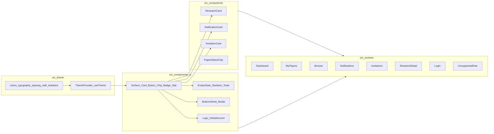

# [NOT STARTED] NUcleus Mobile — Implementation Plan: UI Overhaul

> **STATUS: NOT STARTED**
> *This plan describes a UI-only overhaul of the NUcleus Mobile React Native Expo app on branch `feat/ui-overhaul`. It re-grounds every visible surface in the brand identity and the design system defined in [docs/PRODUCT_ROADMAP.md](../PRODUCT_ROADMAP.md), without touching the data layer, navigation contracts, or domain types. The Supabase migration is fully complete and stable; the data path is frozen for the duration of this work.*

**Canonical product context:** [PROJECT_CONTEXT.md](../PROJECT_CONTEXT.md)

**Primary design reference:** [PRODUCT_ROADMAP.md](../PRODUCT_ROADMAP.md)

**Migration history (do not reopen):** [SUPABASE_MIGRATION.md](./SUPABASE_MIGRATION.md)

---

## 1. Constraints (must hold for every phase)

- Do not touch the data layer. `src/api/research.ts`, `src/api/notifications.ts`, `src/api/invitations.ts`, `src/context/AuthContext.tsx`, `src/lib/supabase.ts`, `src/auth/fetchAppUserProfile.ts`, `src/auth/mapSupabaseAuthError.ts`, and `src/storage/authStorage.ts` are frozen.
- Do not change domain shapes. `src/types/domain.ts` is frozen.
- Do not rename or restructure navigation. `src/navigation/AppNavigator.tsx` and `src/navigation/types.ts` keep their route names, route params, tab order, and gating logic. Visual styling of the navigator (tab bar, header) is the only navigator-level change permitted.
- Do not modify `docs/PROJECT_CONTEXT.md` or `docs/PRODUCT_ROADMAP.md`.
- Brand palette is the anchor. Colors are derived directly from the official NUcleus logo and the roadmap's color system; no off-brand colors are introduced.
- No new product scope. The roadmap's "Future Enhancements" (§6) are explicitly out of scope, except for polish and accessibility items (contrast, dynamic type, reduced motion, micro-interactions). Reading-mode redesign, night mode, in-app PDF viewer, long-press quick actions, and inline annotations are out of scope.
- Run `npx tsc --noEmit` after every code change. A green typecheck is part of every phase's exit criteria.
- Commits are not part of this plan. Commit messages and merge mechanics are handled separately.

---

## 2. Brand and design foundation (anchor)

The brand identity is fixed by the official NUcleus logo and is the source of all primary design tokens. The roadmap's §2 Design System governs how these tokens are applied.

### 2.1 Palette (from the logo)

> **Working values, pending brand confirmation.** The hex values below are the agreed starting points and are subject to fine-tuning at any point during the overhaul. They are not locked. If a confirmed brand swatch arrives mid-phase, the change is a single edit in `src/theme/colors.ts` and propagates everywhere automatically.

- **Primary navy** — the deep blue of the "N" letterform. Working value: `#1B3A8C`. Used for primary CTAs, navigation emphasis, brand surfaces, and links per roadmap §2.
- **Royal blue (mid-tone)** — the lighter blue segment of the orbital swoosh. Used for hover/pressed/active states and decorative gradient stops on brand-only surfaces. Working value: TBD (derived from navy + the swoosh tone in the logo).
- **Accent gold** — the warm amber/gold of the orbital swoosh and orb. Working value: `#F5A623`. Reserved per roadmap §2 for highlights, micro-interactions, and important affordances — never decorative.
- **Neutrals** — clean whites for primary surfaces, soft cool-grays for secondary surfaces and dividers, slate ink for body and headings.

### 2.2 Typography

- **Primary UI font: Outfit** (humanist sans), loaded via `expo-font`. Used for all UI surfaces: tab bar, headers, screen titles, section headings, body copy, metadata, buttons, chips, badges, form labels, and inputs.
- **Display / accent font: Lora** (serif), loaded via `expo-font`. Used sparingly for premium typographic treatments where content is the focus: the paper title in `ResearchDetail` and any other reading-focused surfaces. Realizes roadmap §2's note on serif for "printed-style titling in premium views."
- **Lora is never used for UI chrome.** No Lora in the tab bar, navigation headers, buttons, chips, form labels, metadata, or list-row titles. Outfit owns those surfaces.
- **Designerly balance.** Outfit and Lora pair on a small number of surfaces — primarily `ResearchDetail`'s reading view, where the title is Lora and everything around it stays Outfit.
- **Type scale.** Strong scale across display, h1, h2, h3, body, bodyStrong, metadata, caption — tuned for mobile reading per roadmap §2. Left-aligned body copy; consistent metadata sizing.
- **Loading.** Both fonts are registered via `expo-font` in `App.tsx` and gated behind a top-level loading state so the app never paints before the type system is ready.

### 2.3 Surface and motion rules

- Soft elevation via gentle shadows; no heavy borders.
- Subtle glass/translucent surfaces only for transient overlays (modals, bottom sheets).
- Short-duration easing for reveal/hide; no long or attention-grabbing animations.
- **Animation runtime: React Native core only.** Motion is implemented with `Animated`, `LayoutAnimation`, and `Pressable` feedback. `react-native-reanimated` is excluded for this overhaul. It may be revisited in Phase 9 if a specific native-feel interaction proves limiting; that revisit is a scoped exception, not a default.

### 2.4 Orbital motif

The orbital arc is a brand element that informs subtle decorative or motion details (active-tab indicator, splash/loader pulse, login mark). It is never used as primary content chrome.

---

## 3. Target architecture

### 3.1 Module layout



### 3.2 Preserve vs replace

| Preserve | Replace / refactor |
|----------|---------------------|
| Route names, route params, tab order in `src/navigation/types.ts` | Inline `StyleSheet` literals and hard-coded hex values in every screen |
| Data fetching, RLS contracts, error semantics from `src/api/*` | Ad-hoc loading text, ad-hoc empty states, ad-hoc error strings |
| Domain shapes in `src/types/domain.ts` | Hard-coded chrome colors in tab bar / headers |
| `AuthContext` API surface and `signIn` / `signOut` behavior | Logout placement and styling inside `DashboardScreen` (visual only; `signOut()` call is unchanged) |

---

## 4. Note on Login and UnsupportedRole

`LoginScreen` and `UnsupportedRoleScreen` are not first-class overhaul phases. They are migrated to the new tokens and primitives as part of Phase 2 (Component System) so that no screen is left on legacy chrome, but they receive no bespoke layout redesign in this plan. Reviewers can promote them to a dedicated phase if desired.

---

## 5. Phased plan

### Phase 1 — Design system foundation

⏳ **NOT STARTED**

**What changes and why**

Add a single source of truth for color, typography, spacing, and shadows. This is the prerequisite for every later phase and the mechanism by which the brand palette and roadmap §2 Design System become enforceable in code.

New files (no existing file is modified except `App.tsx` for font registration):

- `src/theme/colors.ts` — primary navy, royal blue, accent gold, neutrals, and semantic aliases (`text.primary`, `text.secondary`, `text.muted`, `surface.base`, `surface.raised`, `border.subtle`, `state.success`, `state.warning`, `state.danger`, `brand.primary`, `brand.accent`). Working values anchored to the logo: navy `#1B3A8C`, gold `#F5A623`. These are starting points, not locked values — see §2.1.
- `src/theme/typography.ts` — type scale (display, h1, h2, h3, body, bodyStrong, bodySmall, label, metadata, caption, button) with sizes, line heights, weights, and letter-spacing. Two font families: `families.ui = 'Outfit'` (weights 400, 500, 600, 700) applied by default to every text style except `display`; `families.display = 'Lora'` (weights 400, 500, 600, 700) applied only to `display` and explicit reading-view variants.
- `src/theme/spacing.ts` — `xs / sm / md / lg / xl / 2xl` = 4 / 8 / 12 / 16 / 24 / 32.
- `src/theme/shadows.ts` — `level0 / level1 / level2` as `ViewStyle` fragments (iOS `shadow*` + Android `elevation`).
- `src/theme/index.ts` — composes a typed `theme` object and re-exports each token group.

Font loading uses `@expo-google-fonts/outfit` and `@expo-google-fonts/lora` (installed via `npx expo install`) and is gated by a top-level loading state in `App.tsx`. The app does not render auth-driven UI before both families resolve.

**Deferred to later phases:**
- `src/theme/radii.ts` — Phase 2, where `Card`, `Button`, and `Chip` are the first consumers.
- `src/theme/motion.ts` — Phase 9, where micro-interactions are introduced.
- `ThemeProvider` and `useTheme()` — deferred until a runtime-theming need (e.g. dark mode) actually exists.

**Exit criteria:**
- `src/theme/colors.ts`, `typography.ts`, `spacing.ts`, `shadows.ts`, `index.ts` all exist and are fully typed.
- `theme` object is importable from `src/theme`.
- Outfit and Lora load via `expo-font`; app boots without a flash of unstyled text.
- `npx tsc --noEmit` passes.
- All existing screens render unchanged — they have not adopted the tokens yet.

---

### Phase 2 — Component system

⏳ **NOT STARTED**

**What changes and why**

Build the component vocabulary defined in roadmap §5 Component System so that screens can be expressed in terms of branded primitives instead of inline `View` + `StyleSheet` blocks.

Token additions deferred from Phase 1:
- `src/theme/radii.ts` — `sm / md / lg / pill` for cards, buttons, chips.

Primitives in `src/components/ui/`:
- `Surface` — themed background with optional elevation level.
- `Card` — `Surface` + standard padding/radius; optional pressable variant.
- `Button` — three variants: `primary` (brand navy fill), `secondary` (outline), `subtle` (text-only). Sizes: `md`, `sm`. Loading state and min 44pt touch target.
- `Chip` — filter chip and status chip variants. Active state uses brand navy fill.
- `Badge` — small unread/count indicator. Uses accent gold sparingly per roadmap §2.
- `Stat` — label + value compact card for Dashboard and Invitations counts.
- `IconButton` — icon-only pressable for headers (e.g., logout).
- `EmptyState` — centered icon + headline + helper text + optional action.
- `Skeleton` — shimmer placeholder for list rows and detail loading.
- `Toast` / `InlineNotice` — non-modal feedback per roadmap §3.
- `BottomSheet` — bottom-anchored modal panel built on RN's `Modal`.
- `Divider` — themed hairline.
- `Logo` and `OrbitalAccent` — brand-mark components for `LoginScreen` and any surface needing the brand glyph.

Feature-level components in `src/components/`:
- `ResearchCard` — title-first, secondary metadata row (author, status chip, date, view/download counts). Presentation-only; consumes a `ResearchPaper` domain type.
- `NotificationCard` — compact title + message + timestamp + read/unread state.
- `InvitationCard` — research title + inviter line + expiry + accept/decline buttons.
- `PaperStatusChip` — thin wrapper over `Chip` mapping `PaperStatus` to a tone. Centralizes status color logic currently duplicated across `DashboardScreen` and `MyPapersScreen`.

Navigator visual config:
- Tab bar in `AppNavigator.tsx`: themed `tabBarActiveTintColor` (brand navy), `tabBarInactiveTintColor` (muted neutral), branded typography, surface/elevation tokens. Route names, gating logic, and tab order unchanged.
- Stack header: themed background, brand-typography title, themed back-button color.
- `FullScreenLoader`: re-skinned with theme tokens and brand mark. Behavior unchanged.

Auth surfaces (token migration only, no layout redesign):
- `LoginScreen` and `UnsupportedRoleScreen`: replace inline hex literals with theme tokens and swap bespoke buttons for the `Button` primitive. `Logo` rendered in `LoginScreen`.

**Exit criteria:**
- All primitives and feature components exist with TypeScript types.
- Tab bar and stack header read brand colors and typography from the theme.
- Login and UnsupportedRole render unchanged in layout but with brand-correct colors and typography.
- `npx tsc --noEmit` passes.
- Manual smoke of auth flow (sign in, sign out, unsupported role) shows no behavioral regression.

---

### Phase 3 — Dashboard overhaul

⏳ **NOT STARTED**

**What changes and why**

Re-implement `DashboardScreen` on top of the design system for roadmap §4.7 Dashboard Experience: "compact overview cards: counts by status, recent activity, and quick links … lightweight analytics: clear numbers and short contextual labels."

Visual changes:
- Replace inline header with a themed greeting block. Subtitle removed entirely.
- **Copy (approved, working values — subject to fine-tuning):**
  - Greeting: `Welcome back, {firstName}.` with fallback `Welcome back.`
  - No subtitle. The greeting stands alone.
- `LogoutButton` replaced by a themed `IconButton` in the screen header. The `signOut()` call from `useAuth()` is preserved verbatim.
- The four `StatCard` views become `Stat` primitives. Count computation logic unchanged.
- Recent papers list uses `ResearchCard`. Empty and loading states use `EmptyState` and `Skeleton`.
- `RefreshControl` is themed.

Structural and behavioral changes: none. `loadData`, `useFocusEffect`, `recentPapers` memo, navigation to `ResearchDetail`, and all data calls are kept exactly as they are.

**Exit criteria:**
- `DashboardScreen` contains no hex literals; all colors, type, spacing, radii, and shadows come from the theme.
- Uses `Stat`, `ResearchCard`, `EmptyState`, `Skeleton`, and `Button` / `IconButton` primitives.
- Logout still signs the user out and triggers the existing nav transition.
- `npx tsc --noEmit` passes.
- Manual smoke: cold start lands on Dashboard, stats compute correctly, recent papers open `ResearchDetail`, refresh works.

---

### Phase 4 — MyPapers overhaul

⏳ **NOT STARTED**

**What changes and why**

Re-implement `MyPapersScreen` for roadmap §4.4 My Papers Experience: "personal list with status chips, recent activity, and contextual quick actions … sort and filter controls that respect student-centric views."

Visual changes:
- Search input becomes a themed `TextInput` wrapper with leading search icon and clear affordance.
- Filter chips (`All`, `In Review`, `Published`, `Needs Action`) become `Chip` primitives. Active state uses brand navy fill.
- Each row becomes a `ResearchCard` with `PaperStatusChip`.
- Empty and loading states use `EmptyState` and `Skeleton`.
- Status sets (`ACTIVE_STATUSES`, `ACTION_STATUSES`, `PUBLISHED_STATUSES`) and `isFilterMatch` move into a co-located helper shared with `PaperStatusChip`. Set values unchanged.

**Exit criteria:**
- `MyPapersScreen` contains no hex literals; uses theme + primitives + `ResearchCard` + `PaperStatusChip`.
- Search and filter behavior is identical to current.
- `npx tsc --noEmit` passes.
- Manual smoke: filter chips toggle, search filters list, refresh works, tap opens detail.

---

### Phase 5 — Browse overhaul

⏳ **NOT STARTED**

**What changes and why**

Re-implement `BrowseScreen` for roadmap §4.2 Research Discovery Experience: "scannable lists with concise metadata … persistent search and simple filters (category, sort) with immediate visual feedback."

Visual changes:
- Developer-facing subtitle removed and replaced with approved copy.
- **Copy (approved, working values — subject to fine-tuning):**
  - Screen title: `Repository`
  - Subtitle: `Published research from NU-Dasmariñas.`
- Category filter row uses `Chip` primitives.
- Each result row uses `ResearchCard`.
- Empty and loading states use `EmptyState` and `Skeleton`.

**Exit criteria:**
- `BrowseScreen` contains no hex literals; uses theme + primitives + `ResearchCard`.
- Category filter, free-text search, and sort behavior are identical to current.
- `npx tsc --noEmit` passes.
- Manual smoke: search filters list, category chip toggles, refresh works, tap opens detail.

---

### Phase 6 — Notifications overhaul

⏳ **NOT STARTED**

**What changes and why**

Re-implement `NotificationsScreen` for roadmap §4.5 Notifications Experience: "chronological list with concise messages and clear targets … lightweight bulk actions (mark read) and unobtrusive unread indicators."

Visual changes:
- Header: title + unread count line. "Mark all read" becomes a `Button` `subtle` variant, disabled when `unreadCount === 0`.
- Each row becomes a `NotificationCard`. Unread indicator uses `Badge` (accent gold) backed by tonal surface tint.
- Empty and loading states use `EmptyState` and `Skeleton`.

**Exit criteria:**
- `NotificationsScreen` contains no hex literals; uses theme + primitives + `NotificationCard` + `Badge`.
- Read/unread visuals are accessible — not relying on color alone.
- `npx tsc --noEmit` passes.
- Manual smoke: opening a notification marks it read; "Mark all read" works; navigation to `ResearchDetail` from notifications works.

---

### Phase 7 — Invitations overhaul

⏳ **NOT STARTED**

**What changes and why**

Re-implement `InvitationsScreen` for roadmap §4.6 Invitations Experience: "clear invitation card with inviter, paper summary, and action affordances (accept/decline) … make decisions low-friction and confidence-building."

Visual changes:
- Three `StatCard`s become `Stat` primitives for `Pending`, `Accepted`, `Closed`.
- Each invitation becomes an `InvitationCard` with `PaperStatusChip`.
- Accept uses `Button` `primary`; Decline uses `Button` `secondary` or danger tone. Loading state uses the primitive's loading state.
- Empty and loading states use `EmptyState` and `Skeleton`.
- Optional: Decline confirmation via `BottomSheet` per roadmap §5.

**Exit criteria:**
- `InvitationsScreen` contains no hex literals; uses theme + primitives + `InvitationCard` + `Stat` + `PaperStatusChip`.
- Accept and decline still persist correctly and the list reloads after either action.
- `npx tsc --noEmit` passes.
- Manual smoke: accept and decline both update the database and the visible list; expired invitations show as expired with no action buttons.

---

### Phase 8 — ResearchDetail overhaul

⏳ **NOT STARTED**

**What changes and why**

Re-implement `ResearchDetailScreen` for roadmap §4.3 Research Detail Experience: "clear content hierarchy: title → authors → abstract → workflow notes → file access … reading mode: reduced chrome, generous line length and spacing."

Visual changes:
- **Paper title is set in Lora** at `display` size with generous line height. This is the one editorial moment in the app where the serif carries content. Status chip, author/co-author meta, dates, and counts remain Outfit.
- Action group ("Open PDF", "Open + Track Download") uses `Button` primary + secondary variants with primitive loading states.
- Abstract uses Outfit body typography. Lora is not used for the abstract body — only the paper title.
- Workflow history uses a vertical timeline: each entry is a card with reviewer role, action, relative time, and optional comment. The orbital motif may inform a subtle vertical accent line.
- Errors render via `InlineNotice` instead of bare red text.

**Exit criteria:**
- `ResearchDetailScreen` contains no hex literals; uses theme + primitives + `PaperStatusChip`.
- Title, metadata, abstract, and workflow map to the roadmap's content hierarchy.
- Open and download flows behave identically; tracking still fires; gating still surfaces a user-facing message.
- `npx tsc --noEmit` passes.
- Manual smoke: open a paper from each entry point (Dashboard, MyPapers, Browse, Notifications); open PDF; open + track download; verify counts increment after refresh.

---

### Phase 9 — Polish and accessibility

⏳ **NOT STARTED**

**What changes and why**

Apply polish and accessibility commitments from roadmap §3 UI / UX System and §6 Future Enhancements → Accessibility across all screens overhauled in Phases 2–8.

- **Micro-interactions and motion** — short-duration press feedback on `Pressable`s, card mount transitions, subtle active-tab accent. All durations from `theme.motion`. RN core only (`Animated`, `LayoutAnimation`, `Pressable`). No `react-native-reanimated`.
- **Reduced motion** — gate all animation effects on `AccessibilityInfo.isReduceMotionEnabled()` with a static fallback.
- **Contrast** — audit every text/surface pairing for WCAG AA (4.5:1 body, 3:1 large text). Adjust tokens if any pair fails.
- **Dynamic type** — replace fixed `fontSize` with a scale-aware helper capped at a sane maximum.
- **Touch targets** — verify every interactive element meets 44pt minimum.
- **Screen-reader labels** — add `accessibilityLabel` and `accessibilityRole` on icon-only buttons and cards that act as links.
- **Status semantics** — confirm status chips communicate state via more than color alone.
- **Loading and empty states** — final pass ensuring skeletons render within ~150ms with no layout shift on first data arrival.

**Exit criteria:**
- Manual a11y pass with TalkBack (Android) and VoiceOver (iOS) on every screen confirms readable focus order and useful labels.
- Reduced-motion mode disables animations; app remains fully usable.
- Maximum dynamic type setting does not break any layout.
- Contrast audit results recorded inline in this section if any token values changed.
- `npx tsc --noEmit` passes.

---

### Phase 10 — Validation and merge

⏳ **NOT STARTED**

**What changes and why**

Final guardrail before merging `feat/ui-overhaul` into `dev`. No new code is written except trivial fixes uncovered during validation.

Smoke-test checklist (must pass on a real device or emulator):

1. **Cold start and session restore** — app boots through loader, lands on Dashboard for a known-good student account, stored session restores without re-prompting credentials.
2. **Login and sign-out** — fresh sign-in works; sign-out from Dashboard returns to Login and clears the session.
3. **Unsupported role** — non-student account lands on `UnsupportedRoleScreen` with a working sign-out.
4. **Browse** — list loads, search filters results, category chips filter results, refresh works, tapping a card opens `ResearchDetail`.
5. **MyPapers** — list loads, all four filters work, search filters within the active filter, refresh works, tap opens detail.
6. **Dashboard** — stats compute correctly, recent papers list opens detail, logout works.
7. **ResearchDetail** — opens from each entry point, abstract and workflow render, "Open PDF" opens the file, "Open + Track Download" opens and increments download count after refresh.
8. **Notifications** — list loads, unread count is correct, opening a notification marks it read and navigates to detail when applicable, "Mark all read" clears unread state.
9. **Invitations** — list loads, counts are correct, accept and decline persist, expired invitations show as expired with no action buttons.
10. **Accessibility spot checks** — TalkBack/VoiceOver on Login, Dashboard, MyPapers, ResearchDetail, and Invitations. Reduced-motion toggle disables animations.
11. **TypeScript** — `npx tsc --noEmit` is green from a fresh checkout.

**Exit criteria:**
- All 11 items above pass.
- No file under `src/api/`, `src/context/AuthContext.tsx`, `src/lib/supabase.ts`, `src/auth/*`, `src/storage/authStorage.ts`, or `src/types/domain.ts` was modified — verified with:
  ```bash
  git diff dev..feat/ui-overhaul -- src/api src/context/AuthContext.tsx src/lib/supabase.ts src/auth src/storage src/types
  ```
  This command must produce no output.
- `src/navigation/types.ts` was not modified; `src/navigation/AppNavigator.tsx` changes are styling-only.
- Branch is ready to merge to `dev`.

---

## 6. Validation strategy (applies to every phase)

After each phase:

1. **TypeScript:** `npx tsc --noEmit`. Non-negotiable before moving on.
2. **Manual smoke:** the relevant subset of the Phase 10 checklist focused on screens touched in the current phase.
3. **Visual regression sweep:** every previously overhauled screen is opened to confirm no token or component change broke its layout.
4. **Read-only diff guard:** `git diff dev..feat/ui-overhaul -- src/api src/context/AuthContext.tsx src/lib/supabase.ts src/auth src/storage src/types src/navigation/types.ts` must produce no output across the entire branch.

---

## 7. Non-goals (explicit)

- No new feature scope. Roadmap §6 items beyond polish/accessibility are out of scope.
- No `react-native-reanimated` dependency. Motion uses React Native core APIs only.
- No data-layer changes. Supabase facades, RLS, RPCs, storage paths, and audit-row inserts are frozen.
- No domain shape changes. `src/types/domain.ts` is frozen.
- No navigation contract changes. Route names, route params, tab order, and gating logic are frozen.
- No copy overhaul beyond the two student-facing subtitle rewrites in Phases 3 and 5, which are approved as working values subject to fine-tuning.
- No localization or i18n work.
- No analytics or telemetry instrumentation.
- No authentication flow changes (forgot password, register, deep-link handling).
- No commit conventions or merge mechanics — handled separately.

---

## 8. Reference files in this repo

| File | Role in this overhaul |
|------|------------------------|
| `App.tsx` | Font loading gate and `ThemeProvider` mount (Phase 1). |
| `src/navigation/AppNavigator.tsx` | Themed tab bar, stack header, `FullScreenLoader` (Phase 2). Routes and gating frozen. |
| `src/navigation/types.ts` | **Frozen.** Route names and params unchanged. |
| `src/types/domain.ts` | **Frozen.** |
| `src/api/research.ts`, `src/api/notifications.ts`, `src/api/invitations.ts` | **Frozen.** |
| `src/context/AuthContext.tsx` | **Frozen.** |
| `src/lib/supabase.ts` | **Frozen.** |
| `src/auth/fetchAppUserProfile.ts`, `src/auth/mapSupabaseAuthError.ts` | **Frozen.** |
| `src/storage/authStorage.ts` | **Frozen.** |
| `src/utils/format.ts` | Reused as-is by `ResearchCard`, `NotificationCard`, `InvitationCard`, and `PaperStatusChip`. |
| `src/screens/auth/LoginScreen.tsx` | Token + primitive migration in Phase 2 (no layout redesign). |
| `src/screens/auth/UnsupportedRoleScreen.tsx` | Token + primitive migration in Phase 2 (no layout redesign). |
| `src/screens/main/DashboardScreen.tsx` | Phase 3. |
| `src/screens/main/MyPapersScreen.tsx` | Phase 4. |
| `src/screens/main/BrowseScreen.tsx` | Phase 5. |
| `src/screens/main/NotificationsScreen.tsx` | Phase 6. |
| `src/screens/main/InvitationsScreen.tsx` | Phase 7. |
| `src/screens/main/ResearchDetailScreen.tsx` | Phase 8. |
| `src/theme/` (new) | Created in Phase 1: `colors.ts`, `typography.ts`, `spacing.ts`, `shadows.ts`, `index.ts`. `radii.ts` added in Phase 2. |
| `@expo-google-fonts/outfit`, `@expo-google-fonts/lora` (new dependencies) | Outfit (UI) and Lora (display) loaded via `expo-font` from `App.tsx` in Phase 1. |
| `src/components/ui/*` (new) | Created in Phase 2. |
| `src/components/ResearchCard.tsx`, `NotificationCard.tsx`, `InvitationCard.tsx`, `PaperStatusChip.tsx` (new) | Created in Phase 2. |

---

## 9. Success criteria (project level)

- Every visible surface of the app reads as institutionally branded NUcleus, anchored in the logo's navy and gold and in the roadmap's design system.
- Every screen consumes design tokens and component primitives; no hex literal remains in any screen file.
- Navigation, data, and domain contracts are byte-identical to `dev` at merge time except for styling-only changes inside `src/navigation/AppNavigator.tsx`.
- `npx tsc --noEmit` is green.
- The Phase 10 smoke checklist passes end-to-end on a real device.
- `docs/PROJECT_CONTEXT.md` and `docs/PRODUCT_ROADMAP.md` remain unchanged.